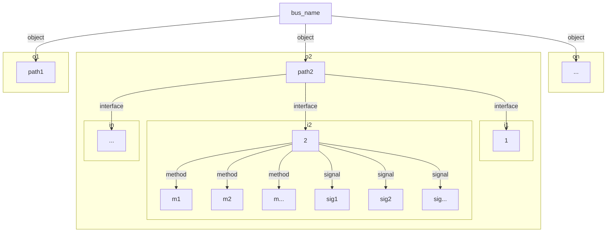
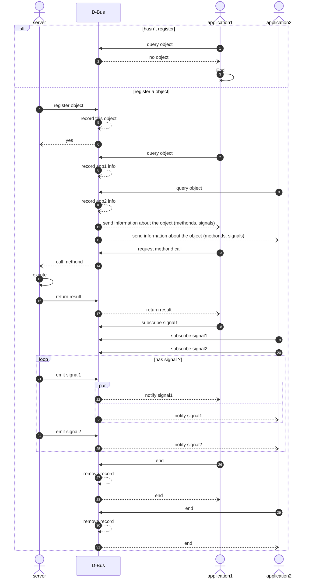

- [一、 What is D-Bus ?](#一-what-is-d-bus-)
  - [1.1 为什么需要？](#11-为什么需要)
  - [1.2 D-bus是什么 ？](#12-d-bus是什么-)
  - [1.3 相关概念](#13-相关概念)
  - [1.4 提供了哪些通信方式 ?](#14-提供了哪些通信方式-)
  - [1.5 有哪些实现库 ？](#15-有哪些实现库-)
    - [1.5.1 low-level libdbus reference library](#151-low-level-libdbus-reference-library)
    - [1.5.2 binding for libdbus参考实现(Higher-level API)](#152-binding-for-libdbus参考实现higher-level-api)
    - [1.5.3 非基于libdbus参考,重写实现D-Bus protocol的](#153-非基于libdbus参考重写实现d-bus-protocol的)
- [二 、 GDBus](#二--gdbus)
  - [GDBus vs dbus-glib](#gdbus-vs-dbus-glib)
  - [具体使用](#具体使用)
- [参考](#参考)
## 一、 What is D-Bus ?
### 1.1 为什么需要？
它是专门为满足安全和系统内IPC需求而量身定制的简单、统一的协议，旨在用来取代该领域中其它IPC框架的竞争者。
>It is intended to replace the amalgam of competing IPC frameworks in this domain with a single, unified protocol that is tailored specifically for meeting the needs of secure, intra-system IPC.  参考:[DBus Overview](https://pythonhosted.org/txdbus/dbus_overview.html)

另可参考[D-Bus Tutorial:D-Bus applications](https://dbus.freedesktop.org/doc/dbus-tutorial.html),讲的更细

### 1.2 D-bus是什么 ？
- 狭义讲：(man dbus-daemon)
    >D-Bus is first a
        library that provides one-to-one communication between any two applications, dbus-daemon is an application that uses this library to implement a message
        bus daemon. Multiple programs connect to the message bus daemon and can exchange messages with one another.

- 广义上： 原文见[参考1](https://freedesktop.org/wiki/Software/dbus/)

    1. D-Bus是一种消息总线系统，是应用程序相互通信(IPC)的一种简单方式。
    2. 用于协调进程生命周期,简化编写“单实例”应用程序或守护程序，使得在需要服务时按需启动应用程序和守护程序变得简单而可靠。

        *第2点按需启动的服务文件如下:*
        ```sh
        ann@dell:~$ cat /usr/share/dbus-1/services/io.elementary.files.Filemanager1.service 
        [D-BUS Service]
        Name=org.freedesktop.FileManager1
        Exec=/usr/bin/io.elementary.files-daemon
        ```
### 1.3 相关概念
|概念|说明| 命名格式 |对比web服务器
|-|-|-|-|
Bus Addresses|指定连接机制（TCP、Unix 套接字等）以及成功连接和身份验证所需的任何额外信息。| 传输名称后跟冒号，后跟可选的、以逗号分隔的一组键=值对。可以在同一个字符串中指定多个地址，用分号分隔。如：“unix:path=/run/dbus/system_bus_socket”|ftp:,http:,sftp:
(unique)Bus Name|总线分配给每个连接上来的的应用的唯一标识名，具有完全唯一且不被复用的特点<br>与object path结合组成一个对象在D-Bus上的唯一的标识地址| 以":"开头的ID， 如: ":1.23"| ip 地址
well-known Bus Name|简单易懂的bus name标识,类似应用在总线上的别名，易记易查<br>名称的仲裁机制：<br>1. 无重名，dbus直接分配<br>2. 有重名，窃取（需满足被窃应用告知过可放弃标识且窃取者设置窃取标识）或排除等候| 反向DNS域名，但可以有下画线， 如: “org.freedesktop.login1” | hostname
Object Path |用来标识一个应用中的某个对象<br>与bus name结合组成一个对象在dbus上的唯一标识地址| 类标准Unix文件系统路径,但只包含数字，字母，下画线和‘/’， 如: "/org/freedesktop/login1" | path on the server 
interface name| 接口,定义了D-Bus对象支持的方法和信号 | 与well-known 一样，如: “org.freedesktop.login1.Manager” | ？POST/GET？
method name | D-Bus对象的方法<br>参数和返回值可以有多个或无;即使无返回值，调用者仍会收到一个"method return"消息,除非调用者设置了不接收标识（如果D-Bus接口实现了的话）| 以字母开头，由数字字母下画线组成，用d-feet查看如: "LockSession (String arg_0) ↦ ()", 箭头后面的括号表示返回值和返回类型,前面的括号表示参数类型|POST/GET
signal name | D-Bus对象的信号<br>提供一对多的发布-订阅机制,不订阅默认不会被通知<br>与方法返回值一样，可以有多个返回值 | 与method name类似|POST/GET

> 通过 D-Bus 导出的对象的 API 由它们支持的接口定义。  D-Bus 中的接口包含接口支持的所有方法和信号的完整列表，以及它们所需的参数数量的确切类型。  对象可以同时支持任意数量的接口。  这个特性可以用来实现与继承机制类似的效果，继承机制在许多编程语言中都有，但 D-Bus 本身并不直接支持。

将所有这些概念结合在一起，要在特定对象实例上指定特定方法调用的配置规则如下:

    Address -> [Bus Name] -> Path -> Interface -> Method


### 1.4 提供了哪些通信方式 ?
通信方式|解释
|--|--|
|one-to-one通信|应用间直接点对点通信，无需消息总线守护进程,这也是D-Bus protol最简单的实现
|D-Bus消息总线|依靠支持RPC（remote procedure calling）和发布订阅机制的守护进程来实现的通信 

点对点不展开讲，后边主要讲下D-Bus消息总线
> 顾名思义，D-Bus使用逻辑“总线”，连接的应用程序可以通过它进行通信。为便于使用，此通信通过一个支持 RPC 和发布订阅机制的简单对象模型进行。  连接到总线的应用程序可以查询对象的可用性，调用它们的远程方法，并对它们发出的信号发出通知请求。--[DBus Overview](https://pythonhosted.org/txdbus/dbus_overview.html#key%20components)

消息总线daemon的两类主要(user-case)用例：
类型|说明| 个数
|-|-|-|
system daemon | 通常在系统init脚本中启动<br>广泛用于广播系统事件，如:"new hardware device added"或"printer queue changed" | 只有一个服务程序，每个登录用户都可与之通信（注：实践中发现system daemon不能连接到用户daemon去）
per-user-login daemon | 针对用户应用间的一般通信需求,或者说桌面环境下的应用间通信| 每个登录用户启动一个，相互之间不能通信 |  


图解如下：



### 1.5 有哪些实现库 ？
#### 1.5.1 low-level libdbus reference library
> libdbus is part of dbus, and is the reference implementation of the D-Bus protocol.
**特点：除依赖XML解析器外，没有其它必需的依赖项。**, 只支持一对一连接，就像原始网络套接字一样。但是，不是通过连接发送字节流，而是发送消息。通过它构建的dbus-daemon实现了消息总线机制。
#### 1.5.2 binding for libdbus参考实现(Higher-level API)
- QtDBus
- Eldbus
- dbus-cxx
- dbus-c++
- DBus-GLib（已废弃）
- ...
#### 1.5.3 非基于libdbus参考,重写实现D-Bus protocol的
- GDBus: part of GNOME's GLib library
- sd-bus: part of libsystemd
- ...
   
-------------
## 二 、 [GDBus](https://docs.gtk.org/gio/migrating-gdbus.html)
### GDBus vs dbus-glib
||GDBus|dbus-glib|
|-|-|-|
基于libdbus|no<br>依赖 GIO 流作为传输层，并有自己的D-Bus连接设置<br>和身份验证实现|yes<br>存在多线程问题
函数参数和<br>返回值类型系统|GVariant type system(match D-Bus types) |GObject type system
models|D-Bus interfaces<br>objects|D-Bus interfaces
native support|org.freedesktop.DBus.Properties<br>org.freedesktop.DBus.ObjectManager | no
从XML内省数据生成粘贴代码工具| gdbus-codegen（支持生成接口文档） | dbus-binding-tool
方便的own/watch API|g_bus_own_name()<br>g_bus_watch_name()|no
对XML的协作支持|yes|no
独立的单元测试|yes<br>GTestDBus|no

### 具体使用
主要针对vala中的用法说明如下：
[Vala D-Bus Examples](https://wiki.gnome.org/Projects/Vala/DBusServerSample#Vala_D-Bus_Examples)


-----
## 参考
1. [https://freedesktop.org/wiki/Software/dbus/](https://freedesktop.org/wiki/Software/dbus/)
