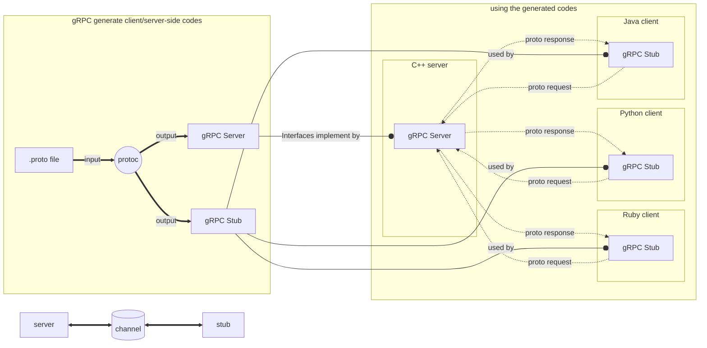

# gRPC 学习笔记

## 概览 Overview



依赖技术：

1. protocol buffer
2. http/2.0

## protocol buffer

1. 参考文档: [protocol buffers documentation](https://protobuf.dev/overview/)
1. what: Google一套成熟开源的、数据结构序列化机制
1. purpose:
    - IDL: 接口定义语言(Interface Definition Language)，用于定义负载消息结构和服务接口
    - message interchange Format: 传输数据格式

1. how:
    - 在一个proto file中定义**数据结构**(proto文件中称为**消息**)及**服务**，该文件是一个后缀扩展名为`.proto`的普通文本文件
    - 使用protocol buffer编译器`protoc`生成对应编程语言的**消息访问类**和gRPC**服务类接口**代码, 生成代码包括了server和client code

    

## 服务的定义

服务定义有消息和服务两个概念，提供了4种接口服务类型，如下表所述：

|类型|译名|说明|
|----|----|---|
|Unary RPCs|一元RPC|如普遍的函数调用，客户端发一个单一请求到服务端并获取到单一的回应|
|Server streaming RPCs|服务端流式RPC|客户端发送一个单一请求给服务端但获得的回应是一个只读数据流，可以从中读取到反馈的一连串消息|
|Client streaming RPCs|客户端流式RPC|客户端向提供的可写数据流输入一系列的消息并将其发送给服务端，客户端输入完后处于等待状态，直到服务端读取完并给出回应。gRPC可以保证调用中消息的排序|
|Bidirectional streaming RPCs|双向流式RPC|客户端和服务端都可以向各自的可写数据流来发送序列化的消息给对方，两条数据流是各自独立的，所以双方可以各自收发而不用等待对方处理，当然每一条流中的数据仍是依序收发的|

示例如下，四个服务从上到下分别对应表中的一元RPC、服务端流式RPC、 客户端酒店式RPC和双向流式RPC， 你可以在[RPC life cycle](https://grpc.io/docs/what-is-grpc/core-concepts/#rpc-life-cycle)章节了解更多

```proto
service HelloService {
  rpc SayHello (HelloRequest) returns (HelloResponse);
  rpc LotsOfReplies (HelloRequest) returns (stream HelloResponse); 
  rpc LotsOfGreetings (stream HelloRequest) returns (HelloResponse);
  rpc BidiHello (stream HelloRequest) returns (stream HelloResponse);
}

message HelloRequest {
  string name = 1;
  int age = 2;
  int heavy = 3;
  message SubRequest {
    string sub_name = 1;
  }
}

message HelloResponse {
  string message = 1;
}
```

定义的消息中 `= 1`并不是赋值1，而是用来告诉protoc编译器这个成员在消息体中的位置信息。

## API的使用

gRPC提供了一个[`protocol buffer`](https://protobuf.dev/reference/cpp/cpp-generated/)编译插件，它可以将`.proto`文件转化生成对应的客户端和服务端代码.

命令行方法： `protoc --proto_path=src --cpp_out=build/gen src/foo.proto src/bar/baz.proto`

- `--cpp_out`: 指定输出C++代码和生成代码输出的目录，指定目录必须存在
- `--proto_path`: 或者用`-I`代替，
- `src/*.proto`: 可以有多个proto文件，protoc编译器会分别为这些文件生成对应代码，其将`src`替代为`--cpp_out`指定的内容即为输出路径（src之下的子目录也会自动创建）
- 生成的文件命名： 将扩展名`.proto`更换为`.ph.h`和`.ph.cc`,其分别对应头文件和实现文件
- 以上生成的只是**消息类型**和其操作接口代码，对应grpc**服务类型**和其接口的实现需要再指定`--plugin=protoc-gen-grpc=`生成，后缀名为`grpc.pb.h`和`grpc.pb.cc`

    示例:

    ```sh
    $ protoc -I ../../protos --grpc_out=. --plugin=protoc-gen-grpc=`which grpc_cpp_plugin` ../../protos/route_guide.proto
    $ protoc -I ../../protos --cpp_out=. ../../protos/route_guide.proto
    ```

    VS python

    ```py
    python -m grpc_tools.protoc -I../../protos --python_out=. --pyi_out=. --grpc_python_out=. ../../protos/route_guide.proto
    ```

代码生成后，gRPC使用者通常在客户端调用这些API，并在服务端实现相应的API接口

### 服务端要做的事

1. 实现服务接口中声明定义的方法

    ```c++
    class GreeterServiceImpl final : public Greeter::Service {
        Status SayHello(ServerContext* context, const HelloRequest* request,
                        HelloReply* reply) override {
            //do something with request and response with reply
            std::string prefix("Hello ");
            reply->set_message(prefix + request->name());
            return Status::OK;
        }
    };
    ```

1. 创建gRPC服务监听在某个IP端口上，并运行（用来处理客户端请求）

    ```c++
    void RunServer() {
        std::string server_address("0.0.0.0:50051");
        GreeterServiceImpl service;

        ServerBuilder builder;
        // Listen on the given address without any authentication mechanism.
        builder.AddListeningPort(server_address, grpc::InsecureServerCredentials());
        // Register "service" as the instance through which we'll communicate with
        // clients. In this case it corresponds to an *synchronous* service.
        builder.RegisterService(&service);
        // Finally assemble the server.
        std::unique_ptr<Server> server(builder.BuildAndStart());

        // Wait for the server to shutdown. Note that some other thread must be
        // responsible for shutting down the server for this call to ever return.
        server->Wait();
    }
    ```

### 客户端要做的事

1. 创建**channels**

   作用：提供一个到指定主机和端口上的gRPC server的连接， 用来创建客户端stub时使用

    ```c++
    Channel channel = grpc::CreateChannel(
      "localhost:50051", grpc::InsecureChannelCredentials());
    ```

1. 通过**channel**申请一个**stub**对象出来

    作用: 代表远端服务的本地对象（在一些语言中，首选术语为client），该对象实现了与服务端相同的方法，

    ```c++
    Greeter::Stub stub_ = Greeter::NewStub(channel);
    ```

1. 客户端只需要在本地封装参数，调用stub中的方法，发送请求获取回复即可

    ```c++
    HelloRequest request;
    request.set_name("world");
    HelloReply reply;

    // Context for the client. It could be used to convey extra information to
    // the server and/or tweak certain RPC behaviors.
    ClientContext context;
    Status status = stub_->SayHello(&context, request, &reply);
    if (status.ok()) {
      return reply.message();
    } else {
      std::cout << status.error_code() << ": " << status.error_message()
                << std::endl;
      return "RPC failed";
    }
    ```

## 代码编译

### 环境

  item              |   Descrition
  ----------------  |  -------------
  OS                |   ubuntu 16.04
  cmake             |   3.16.1
  gRPC              |   1.27.0
  protocol buffer   |   >=3.11.2
  openssl           |   >=1.0.2

### 本地编译

参考源码下的文档: **grpc/BUILDING.md**
本机是linux环境，使用cmake编译

1. 安装编译环境所需

    ```sh
    [sudo] apt-get install build-essential autoconf libtool pkg-config
    [sudo] apt-get install libgflags-dev libgtest-dev
    [sudo] apt-get install clang-5.0 libc++-dev
    ```

1. 16.04版本cmake太低，需要升级cmake, 3.13之前的版本无法编译module。

    ```sh
    wget -q -O cmake-linux.sh https://github.com/Kitware/CMake/releases/download/v3.16.1/cmake-3.16.1-Linux-x86_64.sh
    sh cmake-linux.sh -- --skip-license --prefix=/usr
    rm cmake-linux.sh
    ```

1. clone源代码，并下载submodules的代码以防依赖库缺失，可以clone时加上`--recursive`或者使用`git submodule`子命令，以下是下载最新版本代码，`-b`后可指定相应版本

    ```sh
    git clone -b $(curl -L https://grpc.io/release) https://github.com/grpc/grpc
    # 下载编译所需第三方库
    cd grpc
    git submodule update --init
    ```

    - 外网下载速率慢或无法下载，更换为镜像代理下载

        ```sh
        git config --global url."https://git.homegu.com".insteadOf https://github.com
        ```

    - 切换分支时注意modules重新拉取下，以防第三方库缺失cmake时报错

1. 在仓库clone并且update submodules后，进入grpc目录执行以下操作编译

    ```sh
    mkdir -p cmake/build
    cd cmake/build
    cmake ../..
    make
    ```

   cmake构建编译选项：
   1. `-DBUILD_SHARED_LIBS=ON`: 生成共享库目标
   1. `-DgRPC_<debname>_PROVIDER=module`: 随同gRPC一同构建相应子模块,debname为submodules中的目录名（以大写表示）
   1. `-DgRPC_<debname>_PROVIDER=package`: 使用系统库已存在的外部依赖项副本，而不构建
   1. `-DgRPC_INSTALL=ON`: 生成makefile的install目标
   1. `-DCMAKE_INSTALL_PREFIX=path/to/install` : 指定安装位置
   1. `-DCMAKE_TOOLCHAIN_FILE=path/to/cfg_file.cmake`: 指定cmake的配置文件

### cross编译

参考源码目录：**test/distrib/cpp/run_distrib_test_raspberry_pi.sh**

1. 前提：

    >You can use CMake to cross-compile gRPC for another architecture. In order to
do so, you will first need to build `protoc` and `grpc_cpp_plugin`
for the host architecture. These tools are used during the build of gRPC, so
we need copies of executables that can be run natively.

    必须先编译出在host系统上运行的`protoc`和`grpc_cpp_plugin`两个应用程序，这两个工具将会在cross编译中用到。

1. 安装好toolchain工具链为cross编译做准备
1. 编写一个toolchain file用于CMake构建，

    ```sh
    $ cmake .. -DCMAKE_TOOLCHAIN_FILE=path/to/file
    $ make
    ```

### error 记录

1. “gRPC_SSL_PROVIDER is "module" but BORINGSSL_ROOT_DIR is wrong”

   boringssl缺失，查看`./third_party/boringssl`目录是否正常, 不同分支下可能module不一样，切换时要记得拉取下分支下的第三方模块

    ```sh
    CMake Warning at cmake/ssl.cmake:55 (message):
    gRPC_SSL_PROVIDER is "module" but BORINGSSL_ROOT_DIR is wrong
    Call Stack (most recent call first):
    CMakeLists.txt:194 (include)
    ```

1. boringssl编译报“Could not find Go”，用命令安装go: `apt install golang`

1. cmake生成构建系统时报"Check for working C compiler: xxx-xxx-gcc -- broken"

    看具体报什么错，如下报**uses VFP register arguments, output does not**，该错误表明使用了不正确或不支持的VFP(virtual float point)浮点运算方式，则是gcc的编译选项设置不对，要设置对应的FLAGS.

    ```sh
    -- The C compiler identification is GNU 6.4.0
    -- The CXX compiler identification is GNU 6.4.0
    -- Check for working C compiler: /working_dir/ql-ol-crosstool/sysroots/x86_64-oesdk-linux/usr/bin/arm-oe-linux-gnueabi/arm-oe-linux-gnueabi-gcc
    -- Check for working C compiler: /working_dir/ql-ol-crosstool/sysroots/x86_64-oesdk-linux/usr/bin/arm-oe-linux-gnueabi/arm-oe-linux-gnueabi-gcc -- broken
    CMake Error at /usr/local/share/cmake-3.13/Modules/CMakeTestCCompiler.cmake:52 (message):
    The C compiler

        "/working_dir/ql-ol-crosstool/sysroots/x86_64-oesdk-linux/usr/bin/arm-oe-linux-gnueabi/arm-oe-linux-gnueabi-gcc"

    is not able to compile a simple test program.

    It fails with the following output:

        Change Dir: /working_dir/grpc/build/CMakeFiles/CMakeTmp

        Run Build Command:"/usr/bin/make" "cmTC_21477/fast"
        /usr/bin/make -f CMakeFiles/cmTC_21477.dir/build.make CMakeFiles/cmTC_21477.dir/build
        make[1]: Entering directory '/working_dir/grpc/build/CMakeFiles/CMakeTmp'
        Building C object CMakeFiles/cmTC_21477.dir/testCCompiler.c.o
        /working_dir/ql-ol-crosstool/sysroots/x86_64-oesdk-linux/usr/bin/arm-oe-linux-gnueabi/arm-oe-linux-gnueabi-gcc --sysroot=/working_dir/ql-ol-crosstool/sysroots/armv7ahf-neon-oe-linux-gnueabi   -O3 -DNDEBUG   -o CMakeFiles/cmTC_21477.dir/testCCompiler.c.o   -c /working_dir/grpc/build/CMakeFiles/CMakeTmp/testCCompiler.c
        Linking C executable cmTC_21477
        /usr/local/bin/cmake -E cmake_link_script CMakeFiles/cmTC_21477.dir/link.txt --verbose=1
        /working_dir/ql-ol-crosstool/sysroots/x86_64-oesdk-linux/usr/bin/arm-oe-linux-gnueabi/arm-oe-linux-gnueabi-gcc --sysroot=/working_dir/ql-ol-crosstool/sysroots/armv7ahf-neon-oe-linux-gnueabi   -O3 -DNDEBUG    CMakeFiles/cmTC_21477.dir/testCCompiler.c.o  -o cmTC_21477
        /working_dir/ql-ol-crosstool/sysroots/x86_64-omake -DCMAKE_INSTALL_PREFIX=`pwd`/installed -DCMAKE_BUILD_TYPE=Release -DCARES_STATIC:BOOL=ON -DCARES_SHARED:BOOL=ON -DgRPC_SSL_PROVIDER=package -DgRPC_ZLIB_PROVIDER=packageesdk-linux/usr/bin/arm-oe-linux-gnueabi/../../libexec/arm-oe-linux-gnueabi/gcc/arm-oe-linux-gnueabi/6.4.0/real-ld: error: CMakeFiles/cmTC_21477.dir/testCCompiler.c.o uses VFP register arguments, output does not
        collect2: error: ld returned 1 exit status
        CMakeFiles/cmTC_21477.dir/build.make:86: recipe for target 'cmTC_21477' failed
        make[1]: *** [cmTC_21477] Error 1
        make[1]: Leaving directory '/working_dir/grpc/build/CMakeFiles/CMakeTmp'
        Makefile:121: recipe for target 'cmTC_21477/fast' failed
        make: *** [cmTC_21477/fast] Error 2


    CMake will not be able to correctly generate this project.
    Call Stack (most recent call first):
    CMakeLists.txt:38 (project)

    -- Configuring incomplete, errors occurred!
    See also "/working_dir/grpc/build/CMakeFiles/CMakeOutput.log".
    See also "/working_dir/grpc/build/CMakeFiles/CMakeError.log".
    ```

    如下修改toolchain.cmake， 加入如下内容即可:

    ```sh
    set(CMAKE_CXX_FLAGS "-march=armv7-a -marm -mfpu=neon -mfloat-abi=hard")
    set(CMAKE_C_FLAGS "-march=armv7-a -marm -mfpu=neon -mfloat-abi=hard")
    ```

1. 1.27.0版本在ubuntu22.04中遇到的问题

编译环境：

  tools/src   |   version
  ----------  |  --------
  GCC         |   11.4.0
  cmake       |   3.22.1
  grpc        |   1.27.0

- 问题1：abseil-cpp库编译错 -- "error: ‘numeric_limits’ is not a member of ‘std’"

    ```sh
    grpc/third_party/abseil-cpp/absl/synchronization/internal/graphcycles.cc:451:26: error: ‘numeric_limits’ is not a member of ‘std’
    ```

    这个问题上网查阅之后，需要在third_party/abseil-cpp/absl/synchronization/internal/graphcycles.cc这个.cc文件下添加limits头文件，[参考](https://github.com/abseil/abseil-cpp/issues/1467)

    ```diff
    diff --git a/absl/synchronization/internal/graphcycles.cc b/absl/synchronization/internal/graphcycles.cc
    index 6a2bcdf6..30f81443 100644
    --- a/absl/synchronization/internal/graphcycles.cc
    +++ b/absl/synchronization/internal/graphcycles.cc
    @@ -37,6 +37,7 @@
    
    #include <algorithm>
    #include <array>
    +#include <limits>
    #include "absl/base/internal/hide_ptr.h"
    #include "absl/base/internal/raw_logging.h"
    #include "absl/base/internal/spinlock.h"
    ```

- 问题2：abseil-cpp库编译错 -- “error: no matching function for call to ‘max(long int, int)’”

    ```sh
    /home/anzye/Desktop/5tbox/wnc/grpc/third_party/abseil-cpp/absl/debugging/failure_signal_handler.cc:128:32: error: no matching function for call to ‘max(long int, int)’
    128 |   size_t stack_size = (std::max(SIGSTKSZ, 65536) + page_mask) & ~page_mask;

    ```

    查阅资料，需要将std::max改成std::max<size_t>，如下：

    ```diff
    diff --git a/absl/debugging/failure_signal_handler.cc b/absl/debugging/failure_signal_handler.cc
    index 470d6768..3893aaae 100644
    --- a/absl/debugging/failure_signal_handler.cc
    +++ b/absl/debugging/failure_signal_handler.cc
    @@ -125,7 +125,7 @@ static bool SetupAlternateStackOnce() {
    #else
    const size_t page_mask = sysconf(_SC_PAGESIZE) - 1;
    #endif
    -  size_t stack_size = (std::max(SIGSTKSZ, 65536) + page_mask) & ~page_mask;
    +  size_t stack_size = (std::max<size_t>(SIGSTKSZ, 65536) + page_mask) & ~page_mask;
    #if defined(ADDRESS_SANITIZER) || defined(MEMORY_SANITIZER) || \
        defined(THREAD_SANITIZER)

    ```

- 问题3： abseil-cpp库交叉编译arm版出现"#include_next"问题

    ```sh
    #include_next 导致 cstdlib:fatal error:stdlib.h :No such file or directiry
    ```

  - 使用`-DCMAKE_NO_SYSTEM_FROM_IMPORTED=1`可解决。

  - 使用CMAKE_TOOLCHAIN_FILE配置的方式可解决

- 问题4： boringssl库代码在此环境下编译有问题

    不使用此库，直接使用libssl系统库。
    `cmake -DgRPC_SSL_PROVIDER=package .`

- 问题5: abseil-cpp编译问题: extension.h 中"use of enum 'Id' without previous declaration"

    ```c++
        /working_dir/grpc-1.27.0/grpc/third_party/abseil-cpp/absl/strings/internal/str_format/extension.h:141:8: error: use of enum 'Id' without previous declaration
    141 |   enum Id : uint8_t {
        |        ^~
    /working_dir/grpc-1.27.0/grpc/third_party/abseil-cpp/absl/strings/internal/str_format/extension.h:141:13: error: 'uint8_t' was not declared in this scope
    141 |   enum Id : uint8_t {
        |             ^~~~~~~
    /working_dir/grpc-1.27.0/grpc/third_party/abseil-cpp/absl/strings/internal/str_format/extension.h:28:1: note: 'uint8_t' is defined in header '<cstdint>'; did you forget to '#include <cstdint>'?
    27 | #include "absl/strings/internal/str_format/output.h"
    +++ |+#include <cstdint>
    28 | #include "absl/strings/string_view.h"
    /working_dir/grpc-1.27.0/grpc/third_party/abseil-cpp/absl/strings/internal/str_format/extension.h:141:21: error: default member initializer for unnamed bit-field
    141 |   enum Id : uint8_t {
        |                     ^
    /working_dir/grpc-1.27.0/grpc/third_party/abseil-cpp/absl/strings/internal/str_format/extension.h:144:36: error: 'none' was not declared in this scope
    144 |   static const size_t kNumValues = none + 1;
        |                                    ^~~~
    /working_dir/grpc-1.27.0/grpc/third_party/abseil-cpp/absl/strings/internal/str_format/extension.h:154:27: error: 'Id' has not been declared
    154 |   static LengthMod FromId(Id id) { return LengthMod(id); }
        |                           ^~
    [ 21%] Building CXX object CMakeFiles/gpr.dir/src/core/lib/gpr/string_windows.cc.o
    /working_dir/grpc-1.27.0/grpc/third_party/abseil-cpp/absl/strings/internal/str_format/extension.h:162:3: error: 'Id' does not name a type
    162 |   Id id() const { return id_; }
        |   ^~
    /working_dir/grpc-1.27.0/grpc/third_party/abseil-cpp/absl/strings/internal/str_format/extension.h:176:5: error: 'Id' does not name a type
    176 |     Id value;
        |     ^-DCMAKE_BUILD_TYPE=Release -DCARES_STATIC:BOOL=ON -DCARES_SHARED:BOOL=ON -DgRPC_SSL_PROVIDER=package -DgRPC_ZLIB_PROVIDER=package ..~
    /working_dir/grpc-1.27.0/grpc/third_party/abseil-cpp/absl/strings/internal/str_format/extension.h:182:24: error: expected ')' before 'id'
    182 |   explicit LengthMod(Id id) : id_(id) {}
        |                     ~  ^~~
        |                        )
    /working_dir/grpc-1.27.0/grpc/third_party/abseil-cpp/absl/strings/internal/str_format/extension.h:184:3: error: 'Id' does not name a type
    184 |   Id id_;
        |   ^~
    /working_dir/grpc-1.27.0/grpc/third_party/abseil-cpp/absl/strings/internal/str_format/extension.h: In constructor 'absl::str_format_internal::LengthMod::LengthMod()':
    /working_dir/grpc-1.27.0/grpc/third_party/abseil-cpp/absl/strings/internal/str_format/extension.h:146:17: error: class 'absl::str_format_internal::LengthMod' does not have any field named 'id_'
    146 |   LengthMod() : id_(none) {}
        |                 ^~~
    /working_dir/grpc-1.27.0/grpc/third_party/abseil-cpp/absl/strings/internal/str_format/extension.h:146:21: error: 'none' was not declared in this scope
    146 |   LengthMod() : id_(none) {}
        |                     ^~~~
    /working_dir/grpc-1.27.0/grpc/third_party/abseil-cpp/absl/strings/internal/str_format/extension.h: In static member function 'static absl::str_format_internal::LengthMod absl::str_format_internal::LengthMod::FromIndex(size_t)':
    /working_dir/grpc-1.27.0/grpc/third_party/abseil-cpp/absl/strings/internal/str_format/extension.h:151:32: error: 'const struct absl::str_format_internal::LengthMod::Spec' has no member named 'value'
    151 |     return LengthMod(kSpecs[i].value);
    ```

    GCC-13.3的版本回有此问题，按提示在文件中加以下头文件即可
    27 | #include "absl/strings/internal/str_format/output.h"
    +++ |+#include <cstdint>
    28 | #include "absl/strings/string_view.h"

一个可编译的配置如下：

Pre-requisites:

```sh
sudo apt-get install -y build-essential autoconf libtool pkg-config cmake libc++-dev 
sudo apt-get install -y libgflags-dev libgtest-dev clang golang automake make g++ libssl-dev
```

```sh
cd grpc && mkdir build
cd build
cmake -DCMAKE_INSTALL_PREFIX=`pwd`/installed -DCMAKE_BUILD_TYPE=Release -DCARES_STATIC:BOOL=ON -DCARES_SHARED:BOOL=ON -DgRPC_SSL_PROVIDER=package -DgRPC_ZLIB_PROVIDER=package -DCMAKE_NO_SYSTEM_FROM_IMPORTED=1 ..
```
