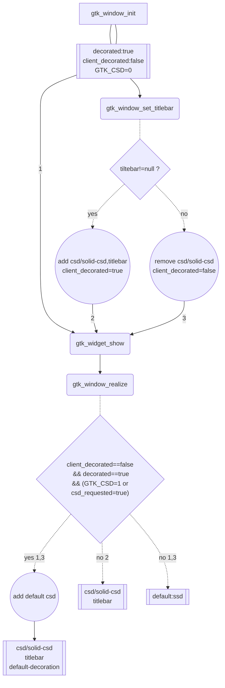

- [参考连接](#参考连接)
- [一 CSD和SSD](#一-csd和ssd)
- [二 标题栏的样式不一的原因](#二-标题栏的样式不一的原因)
- [三 如何统一](#三-如何统一)
    - [3.1 flatpak如何设置样式](#31-flatpak如何设置样式)
    - [3.2 强制使用CSD样式](#32-强制使用csd样式)
    - [3.3 配置SSD样式与CSD样式一致解决](#33-配置ssd样式与csd样式一致解决)
- [四 后记：GTK库中的标题栏如何实现的](#四-后记gtk库中的标题栏如何实现的)
  - [4.1 流程图解如下：](#41-流程图解如下)
  - [4.2 代码分析摘录如下：](#42-代码分析摘录如下)

## 参考连接
1. ​[Client-Side Decoration](https://handwiki.org/wiki/Client-Side_Decoration)
1. [Client-Side Decorations Initiative](https://wiki.gnome.org/Initiatives/CSD)
1. [How To Get Flatpak Apps To Use The Correct Gtk Theme](https://www.linuxuprising.com/2018/05/how-to-get-flatpak-apps-to-use-correct.html)

## 一 CSD和SSD

- CSD:client-side decoration
- SSD:server-side decoration
- OSD: onscreen show display


## 二 标题栏的样式不一的原因

1. 使用GTK和Qt库样式不一导致的不同的桌面环境的风格迥异。
1. 类似在沙箱中运行的程序有独立的一套样式如snap,flatpak,appimage
1. GNOME环境下CSD, SSD的不同风格
1. 各种仍未知的.....

## 三 如何统一
针对二中不同原因各寻办法，此处只涉及二中的2，3部分
#### 3.1 flatpak如何设置样式

- 下载对应的flatpak样式包，针对此需要编译样式表的flatpak包，见[参考连接.3](#参考连接)
- 使用系统已有样式：
   - 由于安全隔离原因，沙箱中的程序是无法访问系统目录的，但可以开放用户目录下的文件访问权限，因此使用如下几个步骤可达到目的：
      - Step 1: 给予Flatpak apps访问GTK themes目录的权限 
         - all app:`sudo flatpak override --filesystem=$HOME/.themes`
         - single app:`sudo flatpak override org.gnome.Calculator --filesystem=$HOME/.themes`
      - Step 2:设置Flatpak apps使用哪个主题 
         - all app:`sudo flatpak override --env=GTK_THEME=my-theme`
         - single app:`sudo flatpak override org.gnome.Calculator --env=GTK_THEME=my-theme`
      - Step 3: 运行一个Flatpak app测试主题切换效果
      - 撤消更改
         - all :`sudo flatpak override --reset`
         - single :`sudo flatpak override --reset org.example.app`
#### 3.2 强制使用CSD样式
在应用中未自行设置标题栏，则窗口管理器的会自行加上默认的标题栏,但默认的标题栏样式并非是CSD形式的。要关闭或启用CSD样式有以下办法：

- 设置环境变量GTK_CSD,1启用,0禁用, 临时测试可在应用前加上该变量如下，原因可[参考](#四-gtk库中的标题栏如何实现的)：
```bash
# GTK_CSD=1 ./test
```

- 下载gtk3-nocsd，配置相应文件禁用CSD,临时测试可如下：
```bash
# gtk3-nocsd test
```

为了一致性要么全部启用csd，要么全部禁用csd。然而， 此法针对chrome等应用无效,故弃用。

#### 3.3 配置SSD样式与CSD样式一致解决
```css
window.csd .titlebar button {
  border-radius: 100px;
}
window.ssd .titlebar button {
  border-radius: 100px;
}
```

注：**_针对默认加载的的标题栏的css的样式，试验发现只在登录环境时加载一次（可能libgtk3库首次加载时会读取记录一次当前设置的样式到自己的上下文中），如果改变了样式文件需要测试默认标题栏是否更改，则必须注销重新登录才能测试出来，否则更改无效_,！！！！前面更改无效遂去研究改GTK库，哭死！！！！**

---------------------------------------------
## 四 后记：GTK库中的标题栏如何实现的
在尝试解决过程中曾想过直接修改gtk库源码，故有此记录，修改gtk源码中对应的theme内容后，使用默认样式重新登录才有效，否则仍无作用。

### 4.1 流程图解如下：



### 4.2 代码分析摘录如下：

- 如果设置了GTK_CSD=1则在窗体的realize中实现默认csd的样式标题，如下：
   - **gtk_window_should_use_csd**获取GTK_CSD值
   - **gtk_window_enable_csd**设置csd样式类 
   - **gtk_header_bar_new**创建标题栏，加载其它样式类
```c
static void
gtk_window_realize (GtkWidget *widget)
{
  GtkWindow *window = GTK_WINDOW (widget);
  GtkWindowPrivate *priv = gtk_window_get_instance_private (window);
 ...

  /* Create default title bar */
  if (!priv->client_decorated && gtk_window_should_use_csd (window))
    {
      priv->use_client_shadow = gtk_window_supports_client_shadow (window);
      if (priv->use_client_shadow)
        {
          gtk_window_enable_csd (window);

            if (priv->title_box == NULL)
              {
                priv->title_box = gtk_header_bar_new ();
                gtk_widget_add_css_class (priv->title_box, "titlebar");
                gtk_widget_add_css_class (priv->title_box, "default-decoration");

                gtk_widget_insert_before (priv->title_box, widget, NULL);
              }

            update_window_actions (window);
        }
    }

  ...

  GTK_WIDGET_CLASS (gtk_window_parent_class)->realize (widget);

  ...

  if (priv->title)
    gdk_toplevel_set_title (GDK_TOPLEVEL (surface), priv->title);

  gdk_toplevel_set_decorated (GDK_TOPLEVEL (surface), priv->decorated && !priv->client_decorated);

  ...
}

static void
gtk_window_enable_csd (GtkWindow *window)
{
  GtkWindowPrivate *priv = gtk_window_get_instance_private (window);
  GtkWidget *widget = GTK_WIDGET (window);

  /* We need a visual with alpha for client shadows */
  if (priv->use_client_shadow)
    gtk_widget_add_css_class (widget, "csd");
  else
    gtk_widget_add_css_class (widget, "solid-csd");

  priv->client_decorated = TRUE;
}

static gboolean
gtk_window_should_use_csd (GtkWindow *window)
{
  GtkWindowPrivate *priv = gtk_window_get_instance_private (window);
  const char *csd_env;

  if (priv->csd_requested)
    return TRUE;

  if (!priv->decorated)
    return FALSE;

  csd_env = g_getenv ("GTK_CSD");

  ...

  return (g_strcmp0 (csd_env, "1") == 0);

```
上述代码中的**gdk_toplevel_set_decorated (GDK_TOPLEVEL (surface), priv->decorated && !priv->client_decorated)**;作用如下所说，因此自己可在代码中可以直接调用`gtk_window_set_decorated`设置无任何窗口装饰。
> /*
> - Setting [@decorated ](/decorated ) to %FALSE hints the desktop environment 
> - that the surface has its own, client-side decorations and
> - does not need to have window decorations added.
> */

- 代码中自行设置标题栏则直接自动加上csd样式类
```c
void
gtk_window_set_titlebar (GtkWindow *window,
                         GtkWidget *titlebar)
{
  ...

  unset_titlebar (window);

  if (titlebar == NULL)
    {
      /* these are updated in realize() */
      priv->client_decorated = FALSE;
      gtk_widget_remove_css_class (widget, "csd");
      gtk_widget_remove_css_class (widget, "solid-csd");
    }
  else
    {
      priv->use_client_shadow = gtk_window_supports_client_shadow (window);

      gtk_window_enable_csd (window);
      priv->titlebar = titlebar;
      priv->title_box = titlebar;
      gtk_widget_insert_before (priv->title_box, widget, NULL);

      gtk_widget_add_css_class (titlebar, "titlebar");
    }
  ...
}
```


