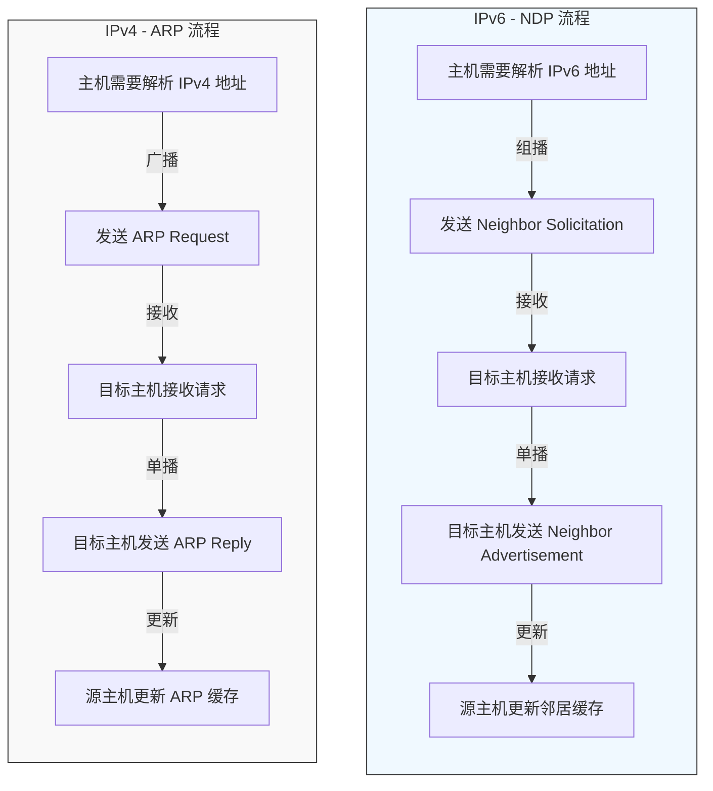

# network command of linux

## conntrack

### 作用

> command line interface for netfilter connection tracking

### conntrack 输出含义

position |ip:port | description
-|-|-|
1 | protocol | <li>tcp:6 <li>udp:17
2 | unkown |
origin | src | origin src ip
origin | dst | origin dst ip
origin | sport | origin src port
origin | dport | origin dst port
expect | src | expect reply src ip， 一般与origin dst相同
expect | dst | expect reply dst ip， 一般与origin src相同,有NAT转换与转换ip相同
expect | sport | expect reply origin src port， 一般与origin dport相同
expect | dport | expect reply origin dst port， 一般与origin sport相同，有NAT转换，与转换port相同

```sh
/ # conntrack -L
tcp      6 3508 ESTABLISHED src=192.168.10.170 dst=17.57.145.132 sport=49417 dport=5223 src=17.57.145.132 dst=10.228.118.101 sport=5223 dport=49417 [ASSURED] mark=0 use=1
tcp      6 20 LAST_ACK src=192.168.10.170 dst=17.248.221.12 sport=49474 dport=443 src=17.248.221.12 dst=10.228.118.101 sport=443 dport=49474 [ASSURED] mark=0 use=1

```

### 解释

上述显示结果中，每行表示一个连接跟踪项。

每行相同的地址和端口号会出现两次，而且第二次出现的源地址/端口对和目标地址/端口对会与第一次正好相反！

这是因为每个连接跟踪项会先后两次被插入连接状态表。

第一个四元组（源地址、目标地址、源端口、目标端口）记录的是原始方向的连接信息，即发送者发送报文的方向。

第二个四元组则记录的是连接跟踪子系统**期望收到**的对端回复报文的连接信息。

这解决了两个问题：

- 如果报文匹配到一个NAT规则，例如IP地址伪装，相应的**映射信息**会记录在链接跟踪项的**回复方向部分**，并自动应用于**同一条流**的**所有**后续报文。（即NAT修改后的信息可从期望回复方向部分找出来）

- 即使一条流经过了地址或端口的转换，也可以成功在连接状态表中查找到回复报文的四元组信息。

**原始方向的（第一个显示的）四元组信息永远不会改变：它就是发送者发送的连接信息。**

NAT 操作只会修改回复方向（第二个）四元组，因为这是接受者看到的连接信息。

修改第一个四元组没有意义：netfilter 无法控制发起者的连接状态，它只能在收到/转发报文时对其施加影响。

**当一个报文未映射到现有连接表项时，连接跟踪可以为其新建一个表项。**

- 对于 UDP 报文，该操作会自动进行。

- 对于 TCP 报文，连接跟踪可以配置为只有 TCP 报文设置了 SYN 标志位 才新建表项。

 默认情况下，连接跟踪会允许从流的中间报文开始创建，这是为了避免对启用连接跟踪之前就存在的流处理出现问题。

## brctl

> ethernet bridge administration, brctl is used to set up, maintain, and inspect the ethernet bridge configuration in the Linux kernel

- 创建bridge

    1. `brctl addbr <name>`
    1. `brctl delbr <name>`
    1. `brctl show`

- PORTS
普通网络设备只有两个端口， 一进（phy）一出(协议栈)， 但bridge可以有多个端口, 下方的ifname即是端口的接口名称。

    1. `brctl addif <brname> <ifname>`
    2. `brctl delif <brname> <ifname>`
    3. `brctl show  <brname>`

注：加某个ports前需要先`ifconfig <brname> down`关掉网桥才能设置

此命令已经是过时了，使用`ip`操作如下

```sh
# 创建bridge
ip link add [name] br_name type bridge
ip link set br_name up
# 删除网桥可以用
ip link delete br_name type bridge
ip link del br_name

# 想要添加Interface到网桥上，interface状态必须是Up
ip link set eth0 up
# 添加eth0 interface到网桥上
ip link set eth0 master br_name
# 从网桥解绑eth0
ip link set eth0 nomaster

# 关闭eth0
ip link set eth0 down
```

## bridge

### 说明

> NAME
> bridge - show / manipulate bridge addresses and devices
>
> SYNOPSIS
> bridge [ OPTIONS ] OBJECT { COMMAND | help }
>
> OBJECT := { link | fdb | mdb | vlan | monitor }
>
> OPTIONS := { -V[ersion] | -s[tatistics] | -n[etns] name | -b[atch] filename | -c[olor] |
> -p[retty] | -j[son] | -o[neline] }
>

- OBJECT:

  - link: Bridge port. correspond to the port devices of the bridge.

  - fdb : Forwarding Database entry. contain known Ethernet addresses on a link.

  - mdb : Multicast group database entry. contain known IP or L2 multicast group addresses on a link

  - vlan: VLAN filter list. contain known VLAN IDs for a link.

### example

1. bridge link show - 查询所有bridges的所有ports信息

displays port configuration and flags for all bridges. 包括非活动端口

如果要显示指定bridge的配置信息可用命令： `ip link show master <bridge_device>`

```sh
bridge link up
22: wlan0 state UP : <BROADCAST,MULTICAST,UP,LOWER_UP> mtu 1358 master bridge0 state forwarding priority 32 cost 100
23: rndis0 state DOWN : <NO-CARRIER,BROADCAST,MULTICAST,UP> mtu 1358 master bridge0 state disabled priority 32 cost 100
```

22/23与`ip link`中的序号一致， wlan0/rndis0就是`ip link`中的接口名。

1. bridge fdb show - 查询mac地址从哪个接口来的

list forwarding entries

```sh
/ # bridge fdb show
33:33:00:00:00:01 dev rmnet0 self permanent
33:33:00:00:00:01 dev bridge0 self permanent
01:00:5e:00:00:01 dev bridge0 self permanent
33:33:ff:6b:7a:74 dev bridge0 self permanent
33:33:00:00:00:02 dev bridge0 self permanent
33:33:ff:00:00:00 dev bridge0 self permanent
b6:e4:7d:6e:7d:77 dev bridge0 master bridge0 permanent（bridge0的MAC地址）
9c:b2:b2:4e:bb:2c dev wlan0 master bridge0            （手机1通过wlan0连接过来）
10:10:c6:eb:5c:d8 dev wlan0 master bridge0 permanent  （wlan0的MAC地址）
a4:cf:99:73:5d:d0 dev wlan0 master bridge0            （手机2通过wlan0连接过来）
33:33:00:00:00:01 dev wlan0 self permanent
01:00:5e:00:00:01 dev wlan0 self permanent
33:33:ff:eb:5c:d8 dev wlan0 self permanent
a2:1d:93:58:0b:f7 dev rndis0 master bridge0 permanent （rndis0的MAC地址）
33:33:00:00:00:01 dev rndis0 self permanent
01:00:5e:00:00:01 dev rndis0 self permanent
33:33:ff:58:0b:f7 dev rndis0 self permanent
```

上边"（）"的注解内容

- LLADDR: 第一列, 即为mac地址(the Ethernet MAC address)
- dev DEV: the interface to which this address is associated, 该mac地址关联的接口名
  - local: is a local permanent fdb entry, 网桥遇到以该mac为目标地址和VLAN ID的数据帧将截止而不转发.
                `bridge fdb add`时，这是默认选项，除非指定了"static"或"dynamic"
  - permanent: "local"的代名词.
  - static: is a static (no arp) fdb entry
  - dynamic: is a dynamic reachable age-able fdb entry
  - self: 标志表示这个操作是由指定的网络设备的驱动程序直接执行的。如果这个网络设备属于一个主设备（如一个桥），那么这个桥会被绕过，不会得到这个操作的通知（如果设备通知了桥，这是特定于驱动程序的行为，而不是由这个标志强制的，请检查驱动程序以获取更多详细信息），“bridge fdb add”命令也可以在桥设备自身上使用，在这种情况下，添加的FDB条目将在本地终止（不会被转发）。在后一种情况下，“self”标志是必需的。如果没有指定“master”，则该标志默认设置。
  - master: 标志表示如果指定的网络设备是一个属于主设备（如一个桥）的端口，则该操作由主设备的驱动程序执行，该驱动程序可能还会向端口驱动程序通知地址。如果指定的设备本身就是一个主设备（如一个桥），则此标志无效。
- brport DEV: 这个地址所关联的桥端口。与上面的dev相同。
- br DEV:  这个地址所关联的桥。
- self: 该地址与端口驱动程序的FDB相关联。通常与硬件相关。
- master: 该地址与主设备FDB相关联。通常是软件（默认）

## arp

> Arp manipulates or displays the kernel's IPv4 network neighbour cache. It can add entries to the table, delete one or display the current content

1. `arp -a`: 查询ip的mac地址

> 在 IPv6 中，ARP 被 邻居发现协议（NDP，Neighbor Discovery Protocol） 取代。NDP 的功能不仅包括地址解析，还扩展了更多能力，例如：
> - 地址解析：将 IPv6 地址映射到链路层地址（类似 ARP 的作用）。
> - 邻居可达性检测：检测邻居是否仍然可达。
> - 自动地址配置：支持无状态地址自动配置（SLAAC）。
> - 路由器发现：主机可以发现可用的路由器。
> - 重复地址检测（DAD）：确保地址唯一性。

### IPv4 ARP vs IPv6 NDP 对比

| 特性                | IPv4 (ARP)                          | IPv6 (NDP)                                      |
|---------------------|-------------------------------------|-------------------------------------------------|
| 协议类型           | ARP (Address Resolution Protocol)  | NDP (Neighbor Discovery Protocol)              |
| 所属协议族         | 独立协议，直接封装在链路层         | 基于 ICMPv6                                    |
| 功能               | 地址解析（IP → MAC）               | 地址解析、邻居可达性检测、路由器发现、自动配置 |
| 消息类型           | ARP Request / ARP Reply            | NS、NA、RS、RA、Redirect                       |
| 广播方式           | 使用广播（Broadcast）              | 使用组播（Multicast）                          |
| 安全性             | 无内置安全机制                     | 可结合 IPsec，支持 SEND（Secure NDP）          |
| 地址配置           | 不支持自动配置                     | 支持 SLAAC（无状态自动配置）                   |
| 重复地址检测       | 不支持                             | 支持（DAD）                                    |



## iptable

flush清空、list查询、zero清数据：

`iptable [-t table] {-F|-L|-Z} [chain [rulenum]] [options...]`

tables有：

- filter
- mangle
- nat
- raw
- security

使用可以参考[smart-gateway.sh](../script/smart-gateway.sh)

## ip

1. ip monitor all -  watch for netlink messages
