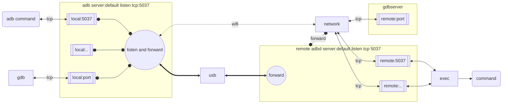

# vscode结合wsl、adb、gdb实现远程调试

## 环境

- window11
- wsl - ubuntu22.04
- vscode

tools |  purpose
-|-
wsl | 用于模拟相应的linux调试环境
[platform-tools](https://github.com/awake558/adb-win) | 安装版本兼容的 ADB/FASTBOOT 工具
[USBIPD-WIN](https://learn.microsoft.com/zh-cn/windows/wsl/connect-usb) | WSL本身并不支持连接 USB 设备，因此你需要安装开源 usbipd-win 项目,用于在wsl中连接win主机上的USB设备
xxx-gdb/gcc/gdbserver | 对应设备的gdb/gcc/gdbserver，编译时需加上-g和-fPIC选项

## 环境搭建

### gdb/gdbserver

1. 在目标机有安装gdbserver
1. 在local host机上安装好gdb
1. 通过网络方式测试是否可连接调试
   1. 在目标机上运行gdbserver： `gdbserver :port-number app`
   2. 记录下目标机的**ip**，后面连接时要用
   3. 在local主机上运行gdb: `gdb app`
   4. 在gdb下输入连接目标：`target remote ip:port-number`
   5. 查看gdbserver是否打印连接消息？

### wsl安装linux

参考：[如何使用 WSL 在 Windows 上安装 Linux](https://learn.microsoft.com/zh-cn/windows/wsl/install)

### 安装USBIPD-WIN项目

#### 参考: [连接 USB 设备](https://learn.microsoft.com/zh-cn/windows/wsl/connect-usb)

#### 使用步骤

1. 查寻adbd usb设备的busid: `usbipd list`
1. 用管理员账户共享adbd usb设备: `usbipd bind -b busid`
1. 附加adbd usb设备到wsl中: `usbipd attach --wsl -b busid`
1. 用`lsusb`看查usb设备是否成功加载
1. 在wsl中使用adb连接usb测试是否OK: `adb devices -l`

#### 注意事项

- 列出可用设备(此处为6-4),留意**设备上的adbd服务**必须跑起来，否则如下列出的信息是看到不对应BUSID为6-4类安卓设备的,只显示为**Persisted**条目
  
    ```sh
    PS C:\Users\anzyelay> usbipd.exe list
    Connected:
    BUSID  VID:PID    DEVICE                                                        STATE
    1-4    1ea7:0064  USB 输入设备                                                  Not shared
    1-5    0489:e0cd  MediaTek Bluetooth Adapter                                    Not shared
    2-1    30c9:00a9  Integrated Camera, Integrated IR Camera, APP Mode             Shared
    6-1    10c4:ea60  Silicon Labs CP210x USB to UART Bridge (COM4)                 Not shared
    6-3    0c72:0012  PCAN-USB FD                                                   Not shared

    Persisted:
    GUID                                  DEVICE
    1e52548e-c2a7-42c7-822c-beb757106947  HighSpeed USB Composite Device (0019), Quectel USB DM Por...C

    PS C:\Users\anzyelay> usbipd.exe list
    Connected:
    BUSID  VID:PID    DEVICE                                                        STATE
    1-4    1ea7:0064  USB 输入设备                                                  Not shared
    1-5    0489:e0cd  MediaTek Bluetooth Adapter                                    Not shared
    2-1    30c9:00a9  Integrated Camera, Integrated IR Camera, APP Mode             Shared
    6-1    10c4:ea60  Silicon Labs CP210x USB to UART Bridge (COM4)                 Not shared
    6-3    0c72:0012  PCAN-USB FD                                                   Not shared
    6-4    2c7c:0435  HighSpeed USB Composite Device (0019), Quectel USB DM Por...  Not Shared

    Persisted:
    GUID                                  DEVICE

    ```

- 要共享USB设备,必须用管理员权限，否则提示如下权限问题，绑定后**STATE**显示为**Shared**状态,说明成功执行共享操作

    ```sh
    usbipd.exe bind -b 6-4
    usbipd: error: Access denied; this operation requires administrator privileges.
    ```

- 附加USB设备到WSL中, USBIPD新版不再需要权限问题, 附加前要确保usb设备未在连接中，其与主机中的adb若未断开时执行附加操作则提示如下“--force”警告信息，需要在主机中使用命令`adb.exe kill-server` kill掉adb服务来断开与adbd的连接

    ```sh
    PS C:\Users\anzyelay> usbipd.exe attach --wsl  -b 6-4
    usbipd: info: Using WSL distribution 'Ubuntu' to attach; the device will be available in all WSL 2 distributions.
    usbipd: info: Using IP address 172.21.32.1 to reach the host.
    WSL usbip: error: Attach Request for 6-4 failed - Device busy (exported)
    usbipd: warning: The device appears to be used by Windows; stop the software using the device, or bind the device using the '--force' option.
    usbipd: error: Failed to attach device with busid '6-4'.    usbipd.exe attach --wsl --busid 6-4

    PS C:\Users\anzyelay> adb.exe kill-server
    PS C:\Users\anzyelay> usbipd.exe attach --wsl  -b 6-4
    usbipd: info: Using WSL distribution 'Ubuntu' to attach; the device will be available in all WSL 2 distributions.
    usbipd: info: Using IP address 172.21.32.1 to reach the host.
    ```

- WSL2中使用usb设备 usbipd: error: WSL ‘usbip‘ client not correctly installed.运行检查/usr/local/binusbip是否有问题，否则重新安装后替换掉

  ```sh
  ##在你的wsl中执行
  sudo apt install linux-tools-virtual hwdata
  sudo update-alternatives --install /usr/local/bin/usbip usbip /usr/lib/linux-tools/path/to/usbip  20

  ```

### 安装PLATFORM-TOOLS

#### 安装步骤

1. 为了使linux上使用的adb与设备板上的adbd兼容，参考win主机上的adb下载对应版本，[链接](https://github.com/anzyelay/adb-win)

1. 解压出来放到/usr/bin下或建立软链接即可

    ```sh
      anzye@LAPTOP-LB5TFG51:platform-tools$ ls /usr/bin/adb -l
      lrwxrwxrwx 1 root root 30  7月 24 19:41 /usr/bin/adb -> /home/anzye/platform-tools/adb
    ```

1. 将用户加入plugdev组，先查询，如果存在就不需要了

    ```sh
    anzye@LAPTOP-LB5TFG51:platform-tools$ groups anzye
    anzye : anzye adm dialout cdrom floppy sudo audio dip video plugdev netdev dockergroups anzye
    ```

1. 安装后新建文件（如无），配置下相应udev配置, id用`lsusb`查询，配置好后重启udev服务加载文件。

    ```sh
    anzye@LAPTOP-LB5TFG51:platform-tools$ cat /etc/udev/rules.d/70-android.rules
    SUBSYSTEM=="usb", ATTRS{idVendor}=="2c7c", ATTRS{idProduct}=="0435",MODE="0666",GROUP="plugdev"
    anzye@LAPTOP-LB5TFG51:platform-tools$ lsusb
    Bus 001 Device 005: ID 2c7c:0435 Quectel Wireless Solutions Co., Ltd. AG35 LTE modem
    anzye@LAPTOP-LB5TFG51:platform-tools$ cat ~/.android/adb_usb.ini
    0x2c7c
    anzye@LAPTOP-LB5TFG51:platform-tools$ sudo service udev restart
    ```
  
1. 重新插拔对应设备测试。

#### 使用方法

- `adb devices -l`: 罗列可用设备
- `adb kill-server`: 关闭与adbd的连接服务
- `adb push local_file device_path`: 上传文件
- `adb pull device_path local_file`: 下载文件
- `adb shell [cmd]`: 登录设备shell或在dev上执行的命令
- `adb forward LOCAL REMOTE`:转发本地socket与设备上的socket通信的服务，local和remote可用tcp:\<port\>形式，如`adb forward tcp:9090 tcp:9090`

#### 注意要点

- adb的通信链路:



- 在adb服务未启动前，任何一个adb命令执行时都会先启动adb服务与adbd进行tcp连接的建立。连接建立成功后，执行各项命令都是通过tcp通信来请求获取返回结果，其服务进程如下所示
  
  ```sh
  anzye@LAPTOP-LB5TFG51:platform-tools$ adb devices
    * daemon not running; starting now at tcp:5037
    * daemon started successfully
    List of devices attached

  anzye@LAPTOP-LB5TFG51:platform-tools$ ps ax | grep adb
  42342 ?        Ssl    0:00 adb -L tcp:5037 fork-server server --reply-fd 4
  ```

  注： 如果在系统上`lsusb`已看到usb设备，但像上边用`adb devices -l`却显示无设备，可尝试命令`adb kill-server`关掉另一个正在连接中的服务。

- 如果提示"no permissions (missing udev rules? user is in the plugdev group)"，则说明udev配置文件有问题，参考[安装platform-tools](#安装platform-tools)中的配置说明,配置完成后重新附加usb设备
  
  ```sh
  anzye@LAPTOP-LB5TFG51:platform-tools$ adb devices -l
  * daemon not running; starting now at tcp:5037
  * daemon started successfully
  List of devices attached
  abceb966               no permissions (missing udev rules? user is in the plugdev group); see [http://developer.android.com/tools/device.html] usb:1-1 transport_id:1

  anzye@LAPTOP-LB5TFG51:platform-tools$ adb kill-server
  anzye@LAPTOP-LB5TFG51:platform-tools$ usbipd.exe detach -b 6-4
  anzye@LAPTOP-LB5TFG51:platform-tools$ usbipd.exe attach --wsl -b 6-4
  anzye@LAPTOP-LB5TFG51:platform-tools$ adb devices
  List of devices attached
  abceb966        device  
  ```

### vscode c/c++插件安装

#### 安装插件 [C++ extension for VS Code.](https://code.visualstudio.com/docs/cpp/config-linux)

#### 配置文件

在.vscode下有以下三个文件：

- tasks.json (编译构建设置)
- launch.json (debugger调试设置)
- c_cpp_properties.json (compiler path and IntelliSense settings)

任务示例，可以写个build.sh脚本执行构建任务：

```json
{
  "version": "2.0.0",
  "tasks": [
    {
      "type": "shell",
      "label": "C/C++: build active file",//用于标识任务名称ID，在launch中可以用做preLaunchTask值用
      "command": "/usr/bin/make",
      "args": ["-f", "Makefile"],
      "options": {
        "cwd": "${fileDirname}/.."
      },
      "group": {
        "kind": "build",
        "isDefault": true
      },
      "detail": "Task generated by Debugger."
    },
    {
      "label": "build and push",
      "type": "shell",
      "command": "./build.sh"
    }
  ]
}
```

lauch示例：

```json
{
  "version": "0.2.0",
  "configurations": [
    {
      "name": "C/C++: g++ build and debug active file",
      "type": "cppdbg",
      "request": "launch",
      "program": "${fileDirname}/${fileBasenameNoExtension}",//本地编译出的程序，非远程设备上的
      "args": [],
      "stopAtEntry": false,
      "cwd": "${workspaceFolder}",//运行当前目录
      "environment": [],
      "externalConsole": false,
      "MIMode": "gdb",
      "setupCommands": [
        {
          "description": "Enable pretty-printing for gdb",
          "text": "-enable-pretty-printing",
          "ignoreFailures": true
        }
      ],
      "preLaunchTask": "build and push",
      "miDebuggerPath": "/usr/bin/gdb",//编译程序的gcc相对应的gdb, 即arm-linux-gcc --> arm-linux-gdb
      "miDebuggerServerAddress": ":9080"//与gdbserver ip:port program 相对应的ip:port, ip不填为localhost. 
    }
  ]
}
```

## 远程调试步骤

1. 将跑adbd设备的USB附加到wsl的linux中

    - 先关闭已有连接：`adb kill-server`
    - 查看busid: `usbipd.exe list`
    - 打开管理员powershell执行共享操作: `usbipd.exe bind -b <busid>`
    - 附加设备到目标机：`usbipd.exe attach --wsl -b <busid>`
    - 测试是否可用: `adb devices -l`

1. 设置端口转发

   `adb forward tcp:9090 tcp:9090`

1. 在板子上运行gdbserver调试程序

    `gdbsever :9090 /path/to/program`

1. vscode配置对应连接,配置**miDebuggerPath**,**miDebuggerServerAddress**, 端口号配置成adb设置的转发端口

    ```json
    "miDebuggerServerAddress": ":9090"
    ```

1. 运行vscode的调试任务开始happy work

### 创建个task任务自行处理上述2--3步

build.sh

```sh
make clean && make
adb shell "killall app"

adb forward tcp:9090 tcp:9090

adb push app /tmp
adb shell "chmod +x /tmp/app"
adb shell "gdbserver :9090 /tmp/app"
exit 0
```

在launch.json将task加到preLaunchTask中

注： 如果出现"Cannot find bounds of current fucntion"错，检查编译选项-fPIC是否未加，否则可以尝试设置sysroot，在setupCommands中增加

```json
"setupCommands": [
  {
    "text": "set sysroot ${workspaceFolder}/debug_so_path/",
    "description": "set sysroot path"
  }
]
```

## 参考

1. [Configure C/C++ debugging](https://code.visualstudio.com/docs/cpp/launch-json-reference)
2. [使用GDB在VS Code调试Android C/C++代码（无需Android源码）_gdbclient.py-CSDN博客](https://blog.csdn.net/u011057800/article/details/108094858)
3. [Android adb远程调试_as adb远程调试-CSDN博客](https://blog.csdn.net/u012785382/article/details/79171782)
