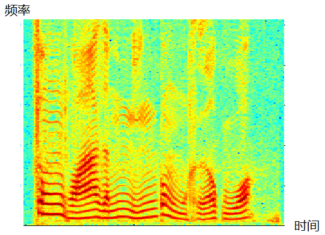
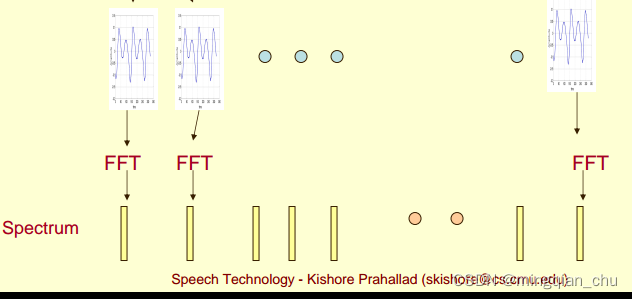

# 语谱图（一） Spectrogram 的定义与机理

- 转自<<https://blog.csdn.net/chumingqian/article/details/123019808>>

## 语谱图 spectrogram

在音频、语音信号处理领域，我们需要将信号转换成对应的语谱图(spectrogram)，将语谱图上的数据作为信号的特征。

语谱图的横坐标是时间，纵坐标是频率，坐标点值为语音数据能量。由于是采用二维平面表达三维信息，所以能量值的大小是通过颜色来表示的，颜色深，表示该点的语音能量越强。

## 语谱图形成过程

1. 信号预加重
1. 对信号进行分帧加窗，进行STFT， 得到每帧信号的频谱图；
1. 对频谱图进行旋转 加映射；
1. 将变换后的多帧频谱进行拼接， 形成语谱图；

## 语谱图的具体实现步骤

### 3.1 预加重

因为语音信号的功率谱随频率的增加而减小，

导致语音的大部分能量都集中在低频部分，

从而导致高频部分的信噪比很低。
因此一般使用一阶高通滤波器去提升信号在高频部分的信噪比。

对语音进行完预加重后，然后就是分帧加窗操作；

### 3.2 分帧与加窗

对于一段语音，以10ms~30ms 为一帧，为了保证帧与帧之间平滑过渡保持连续性，帧与帧之间会有重叠。

一段语音信号x(t) , 通过分帧之后， 数据由一维信号变为二维信号；

分帧之后，变为x(m,n)
m为帧长， 代表每一帧的长度；
n 为帧的个数， n 列代 n个帧；

下图是分帧加窗的示例 ， 这段语音被分为很多帧;

### 3.3 语谱图的形成原理

#### 3.3.1 频谱spectrum 的产生

将每一帧的数据都进行FFT变换（严格来讲， 每帧数据加窗后做FFT ， 称之为STFT)，由x(m,n) 得到X(m,n)。

X(m,n) 称作频谱， 反应了频率与能量之间的关系。

频谱图：

在实际使用中，频谱图有三种，即

- 线性振幅谱、

- 对数振幅谱：**（对数振幅谱中各谱线的振幅都作了对数计算，所以其纵坐标的单位是dB分贝）**

- 自功率谱

**这个变换的目的是使那些振幅较低的成分相对高振幅成分得以拉高，以便观察掩盖在低幅噪声中的周期信号。**

上图反应了，每帧信号对其做FFT 变换（更具体点，是通过短时FFT计算）。

每帧语音都对应于一个频谱spectrum, 如图中spectrum 所示。

>注意：短时傅立叶变换（STFT），返回一个复数矩阵使得D(f,t)
复数的实部：np.abs(D(f,t))频率的振幅
复数的虚部：np.angle(D(f,t))频率的相位

#### 3.3.2 单帧语音的频谱处理

我们取出其中一帧语音的频谱，做如下处理：

1. 原始一帧语音的频谱，换一种表达方式，使用坐标表示出来， 横轴代表频率， 纵轴代表幅度值；

1. 将该坐标轴旋转 90 度，横轴代表幅度值，纵轴代表频率；

1. 对幅度值进行映射，通过量化的方式，0表示白，255表示黑色。幅度值越大，相应的区域越黑， 从而去除了幅度值，这个维度， 多出一个维度用作表达其他信息；

至此，我们应该明白，对频谱图进行上述操作，
**是为了去除了幅度值这个维度， 多出一个维度用作表达时间这个维度信息；**

#### 3.3.3 对多帧语音的频谱进行拼接

对多帧频谱， 重复上述单帧频谱的操作；

将变换后的多帧频谱， 在时间维度上，进行拼接， 从而形成了多帧信号的语谱图；

这样就可以显示一段语音而不是一帧语音的功率谱，而且可以直观的看到静态和动态的信息。

### 3.4 STFT的运行流程

## 为什么需要语谱图？

因为声谱图中有很多重要的特征， 比如音素特征；
共振峰特征（formants 即频谱图中的峰值）
以及观察他们的转变趋势， 可以更好的识别音频；

- 语音信号的时间-频率表示方法：

- 语谱图是研究语音（音素Phone）的工具

- 语音学家对音素Phone及其特性进行直观研究

- 隐马尔科夫模型隐含了语音到文本系统的语谱图模型

- 有助于评估文本到语音系统——一个高质量的文本到语音系统应该产生合成语音，其频谱图应该与自然句子几乎一致

## 频谱与语谱图之间的关系

从上述分析， 单帧的信号的频谱可以看出，
> **语谱图这个概念的出现， 是为了弥补频谱图，丢失了时间这个维度的信息， 故而增加了时间这个维度。**
> 
> 具体的方式， 就是将频谱中的幅度值 这个维度替换掉（使用颜色的深度来表示)，从多出了一个维度；
>
> 而这个多出的维度， 便是留作扩展出，时间这个维度的信息；
>

**所以， 语谱图使用二维的表现形式， 涵盖了三个维度的信息**
（纵轴：频率， 横轴： 时间； 颜色深度： 幅度值大小）
