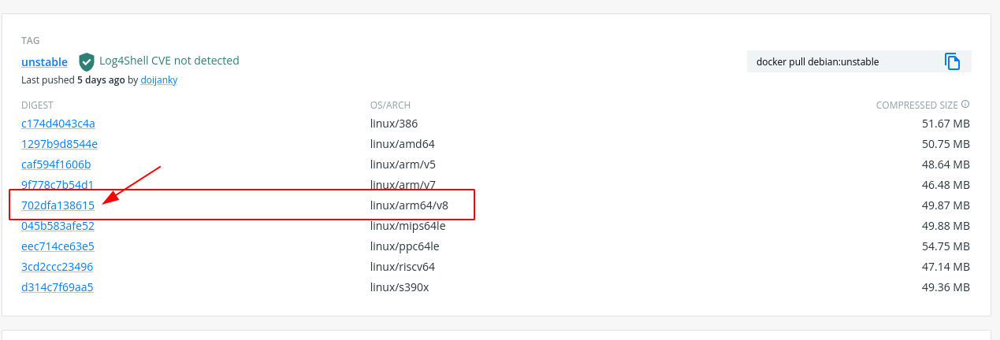
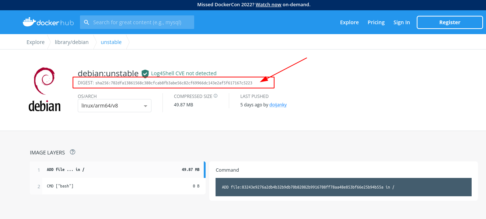

# 参考
1. [How to Build and Run ARM Docker Images on x86 Hosts](https://matchboxdorry.gitbooks.io/matchboxblog/content/blogs/build_and_run_arm_images.html)
2. [Docker：使用x86平台Docker 拉取 arm版镜像](https://www.cnblogs.com/nhdlb/p/15233410.html)

# 拉取不同平台的镜像
## 方法一： 使用manifest
### 开启manifest特性
- 首先修改docker配置（如果文件不存在就新建，存在的话就追加配置，记得追加时检查下逗号别忘）
  ```sh
  #如果没有配置文件的话，新建
    mkdir /root/.docker

    #进入docker配置目录
    cd /root/.docker/

    #修改配置文件
    vi config.json
  ```
  配置信息如下：
  ```json
    {
    "auth": {},
    "experimental": "enabled"   
    }
  ```
- 开启manifest实验特性,
    ```sh
    #如果没有配置文件的话，新建
    vi /etc/docker/daemon.json
    ```
    配置信息如下：

    ```json
    {
        "registry-mirrors": ["https://r9xxm8z8.mirror.aliyuncs.com","https://registry.docker-cn.com"],
        "experimental": true  
    }
    ```
    registry-mirrors : 添加阿里云加速源，也可以直接 [ ];

 - 重加载服务配置并重启docker
    ```sh
    #重新加载服务的配置文件
    systemctl daemon-reload

    #重启docker
    systemctl restart docker

    #查看docker是否开启experimental功能
    docker version 
    ```
### 拉取指定平台镜像
 - docker pull --platform=arm64 镜像名:版本
    ```sh
    docker pull --platform=arm64 debian:unstable
    ```
    --platform：该参数是用于拉取指定平台的镜像，也是实验性功能，在开启manifest功能后就会出现。通过该参数可以手动指定需要的CPU平台镜像，而不用自动去识别。


## 方法二： 通过镜像的sha256值拉取（大概率会失败）
以拉取arm64的debian为例：
- 在dockerhub中找到对应的debian容器：https://registry.hub.docker.com/_/debian?tab=tags
- 找到相应的版本如下图所示：
  
- 执行拉取命令:
  ```sh
  docker pull debian:unstable@sha256:702dfa13861568c380cfcab8fb3abe56c82cf69966dc143e2af5f617167c5223
  ```

# Run ARM Containers on x86 Hosts
##  Install QEMU
```sh
apt-get update && apt-get install -y --no-install-recommends qemu-user-static binfmt-support
update-binfmts --enable qemu-arm
update-binfmts --display qemu-arm 
```
> Please make sure that the qemu-arm-static binary is under /usr/bin/ directory of your system. If not, copy it from post-compiled qemu file.


## 将"qemu-arm-static"放到容器中，并[运行docker](../docker.md)
```sh
docker run -it --name your-container-name -v /usr/bin/qemu-arm-static:/usr/bin/qemu-arm-static your-arm-image 
```

## 如果不想在容器中运行，且有对应的arm文件系统，则直接拷贝到/usr/bin/下，用chroot方式执行
```sh
cp /usr/bin/qemu-arm-static arm_rootfs/usr/bin/
chroot arm_rootfs
``` 
