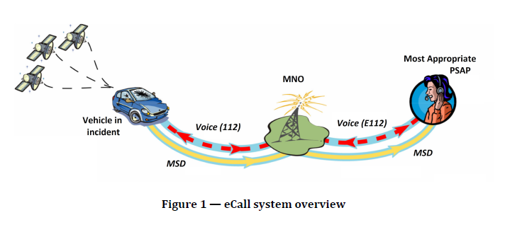

# prEN 16072:2024《泛欧洲 eCall 运行要求》全文解读

## 一、文件定位与目的

本文件是 **泛欧洲车载紧急呼叫系统（eCall）的运行要求标准**，规定了在发生交通事故或紧急情况时，车辆如何通过公共移动通信网络，自动或手动向 **公共安全应答点（PSAP）** 发起紧急呼叫，并传输关键数据与建立语音通道。

- 文件状态：**欧洲标准草案（Draft）**
- 将替代：EN 16072:2022
- 适用范围：欧洲范围内的 eCall 公共服务
- 核心目标：
  - 自动化事故通报
  - 缩短救援响应时间
  - 支持跨国、跨语言的一致紧急服务

---

## 二、适用范围（Clause 1）

- 规定 **基于公共陆地移动网络（PLMN）** 的 eCall 服务运行要求
- 覆盖：
  - 自动触发 eCall
  - 手动触发 eCall
  - 车辆至 PSAP 的数据与语音通信
- 明确不包含：
  - 私人第三方紧急服务（由 EN 16102 规定）
  - MSD 的具体数据结构（由 EN 15722 定义）
  - 具体通信协议细节（由 EN 16062、EN 17184 等定义）

---

## 三、规范性引用文件（Clause 2）

关键依赖标准包括：

- **EN 15722**：eCall 最小数据集（MSD）
- **EN 16062 / EN 17184**：eCall 高层应用协议（CS / IMS）
- **EN 16454 / EN 17240 / prEN 18052**：端到端一致性测试
- **IETF RFC 8147**：下一代 eCall
- **ETSI / 3GPP 安全与通信标准**

---

## 四、术语与定义（Clause 3）

定义了 eCall 体系的统一术语，包括：

- **eCall**：自动或手动生成的车辆紧急呼叫
- **IVS（车载系统）**
- **MSD（最小数据集）**
- **PSAP（公共安全应答点）**
- **MNO（移动网络运营商）**
- **TS12 / IMS eCall**
为跨国、跨系统一致理解提供基础。

---

## 五、符合性（Clause 5）

- 符合性测试不在本文件中详细规定
- 具体测试由相关配套标准完成
- 不同角色（车辆、网络、PSAP）只对自身控制范围负责

---

## 六、高层功能要求（Clause 6）

### Architecture



### 6.1 eCall 车载系统功能

- 必须具备：
  - 网络接入设备（NAD）
  - 自动与手动触发能力
  - 崩溃后可存活能力
- 触发后：
  - 建立紧急呼叫
  - 发送 MSD
  - 建立语音通道

### 6.1.5 eCall 运行顺序

- eCall 包含 **语音 + MSD**
- 网络通过以下方式识别呼叫类型
  - CS: **eCall flag**
  - PS: **service URN**
- 网络按紧急呼叫处理
- 呼叫被路由至最合适 PSAP
- PSAP 确认 MSD 后开启语音对话

### 6.2 eCall 服务链

- 三大核心参与方：
  - 车载设备提供方
  - 移动网络运营商
  - PSAP
- 强调：
  - 隐私保护
  - eCall 为“休眠服务”，仅在触发时激活
  - PSAP 需具备 GIS 能力解析位置与方向

---

## 七、运行要求（Clause 7）

### 7.1–7.4 总体运行与优先级

- eCall 是 **最高优先级紧急通信**
- 可中断车辆内其他通信
- 支持泛欧洲漫游

### 7.5 碰撞后性能

- 车载系统应在法规要求的碰撞测试中：
  - 仍能发送 MSD
  - 尽可能建立语音通道

### 7.6 位置信息与方向

- 位置信息格式必须符合 EN 15722
- MSD 包含：
  - 当前参考位置
  - 触发前 15 秒内的 2 个历史位置
- 提供方向信息以帮助 PSAP 判断行驶车道

### 7.7 最小数据集（MSD）

- 必须发送所有 **强制字段**
- 可发送 **可选附加数据**
- 可选数据需：
  - 注册至公共 ITS 数据注册表
  - PSAP 可正确解码或提示解码失败

### 7.8–7.10 触发与人机交互

- 自动 eCall：
  - 默认随点火激活
  - 不允许乘员取消
- 手动 eCall：
  - 需防止误触
  - 可在短时间内取消
- 系统需清晰提示 eCall 状态

### 7.11–7.16 呼叫维护与终止

- eCall 只能由 PSAP 终止
- 支持：
  - 自动重拨
  - PSAP 回呼
- 终止后系统需：
  - 至少 1 小时保持网络注册
  - 记录 eCall 交易信息（遵守数据保护法规）

---

## 八、安全与防攻击（Clause 8）

- eCall 享有与 112 相同的安全等级
- 使用 USIM、IMEI 进行认证
- 相比普通语音紧急呼叫：
  - 更难伪造
  - 更不易遭受拒绝服务攻击
- 支持 IMS eCall 的网络安全机制

---

## 九、不同车辆类别要求（Clause 9）

- 本文件主要适用于 **M1、N1 类车辆**
- 其他 UNECE 类别：
  - 由单独技术规范补充（如 CEN/TS 17249、CEN/TS 16405）

---

## 十、测试与一致性（Clause 10）

- 分角色定义符合性：
  - 车载设备
  - 网络
  - PSAP
- 明确要求：
  - 当通信技术退网时，必须提供迁移路径
- 互操作测试由 ETSI 标准定义

---

## 十一、标识与包装（Clause 11）

- 本文件 **未规定**任何标识、标签或包装要求

---

## 十二、总体理解总结

本标准是 **eCall 公共服务的“运行规则书”**，明确了：

- 谁参与（车辆、网络、PSAP）
- 怎么触发（自动 / 手动）
- 传什么（MSD + 语音）
- 如何保障（优先级、安全、隐私）
- 如何在欧洲范围内一致运行

其核心价值在于：
**确保无论车辆在哪里发生事故，都能以统一、可靠、可互操作的方式向紧急服务发出求助。**

## Q & A

1. **什么是 ETSI “prime medium”？**

    > it uses an ETSI prime medium when transmitting the MSD message

    在 eCall 技术体系里，“prime medium” 不是某一项具体技术名，而是一个 类别定义（class of media）

    它表示：

    > ETSI 正式定义为可用于 eCall MSD 传输的主要通信媒体，必须满足 ETSI 技术标准接口要求。

    目前，在 eCall 世界里，被 ETSI 指定的 “prime medium” 只有两种：

     1. **Circuit‑Switched eCall（CS eCall）的 prime medium：→ GSM/UMTS CS 语音通道 + In‑band Modem**

        在 2G / 3G eCall 中：

        - Prime medium = TS12（Circuit Switched emergency call）
        - MSD 数据通过 In‑band Modem 在电路语音通道传输（TS 26.267/268/269）

     2. **IMS eCall（NG eCall）的 prime medium：→ IMS Emergency Call + SIP INVITE / RTP audio**

        在 IMS eCall（基于 LTE/5G 的 eCall）中：

        - Prime medium = IMS SIP emergency call（RFC 8147 + EN 17184）
        - MSD
          - 优先在 SIP INVITE 里发送
          - fallback 模式 MSD 使用 RTP 语音的 `in‑band` 调制


    **eCall的MSD必须通过ETSI指定的标准紧急通信链路发送，而不是走普通数据通道、TCP/UDP、短信或车厂自定义方式**。

    *CS 域 eCall: 通过 CS Audio（IN‑BAND modem） 传输*

    ```text
    ┌──────────────────────────────┐            ┌──────────────────────────────┐
    │        IVS (Vehicle)         │            │            PSAP              │
    │                              │            │                              │
    │  ┌──────────────────────┐    │            │  ┌──────────────────────┐    │
    │  │   eCall Application  │    │            │  │   eCall Application  │    │
    │  │  - Generate MSD      │    │            │  │  - Receive MSD       │    │
    │  └──────────┬───────────┘    │            │  └──────────┬───────────┘    │
    │             │ MSD (binary)   │            │             ▲                │
    │             ▼                │            │             │                │
    │  ┌──────────────────────┐    │            │  ┌──────────────────────┐    │
    │  │   In‑Band Modem      │    │            │  │   In‑Band Modem      │    │
    │  │  (MSD <-> Tone)      │    │            │  │  (Tone -> MSD)      │     │
    │  └──────────┬───────────┘    │            │  └──────────┬───────────┘    │
    │             │ Audio PCM      │            │             ▲                │
    │             ▼                │            │             │                │
    │  ┌──────────────────────┐    │            │  ┌──────────────────────┐    │
    │  │ Speech Codec         │    │            │  │ Speech Codec         │    │
    │  │ (AMR‑CS / EFR)       │    │            │  │                      │    │
    │  └──────────┬───────────┘    │            │  └──────────┬───────────┘    │
    │             │                │ CS Audio   │             ▲                │
    │  ┌──────────────────────┐════╪════════════╪══┌──────────────────────┐    │
    │  │ CS Voice Bearer      │    │ (Circuit)  │  │ CS Voice Bearer      │    │
    │  └──────────┬───────────┘    │            │  └──────────┬───────────┘    │
    │             │                │            │             │                │
    └──────────────────────────────┘            └──────────────────────────────┘
    │======================  CS Domain (2G / 3G Circuit) ======================│
    ```

     *IMS / PS 域 eCall: 通过 SIP（Signaling Plane）传输 **VS** 通过 RTP Audio（IN‑BAND modem）传输*

    ```text
    ┌──────────────────────────────┐            ┌──────────────────────────────┐                 ┌──────────────────────────────┐            ┌──────────────────────────────┐
    │        IVS (Vehicle)         │            │            PSAP              │                 │        IVS (Vehicle)         │            │            PSAP              │
    │                              │            │                              │                 │                              │            │                              │
    │  ┌──────────────────────┐    │            │  ┌──────────────────────┐    │                 │  ┌──────────────────────┐    │            │  ┌──────────────────────┐    │
    │  │   eCall Application  │    │            │  │   eCall Application  │    │                 │  │   eCall Application  │    │            │  │   eCall Application  │    │
    │  │  - Generate MSD      │    │            │  │  - Receive MSD       │    │                 │  │  - Generate MSD      │    │            │  │  - Receive MSD       │    │
    │  └──────────┬───────────┘    │            │  └──────────┬───────────┘    │                 │  └──────────┬───────────┘    │            │  └──────────┬───────────┘    │
    │             │ MSD XML/ASN.1  │            │             ▲                │                 │             │ MSD (binary)   │            │             ▲                │
    │             ▼                │            │             │                │                 │             ▼                │            │             │                │
    │  ┌──────────────────────┐    │ SIP INVITE │  ┌──────────────────────┐    │                 │  ┌──────────────────────┐    │            │  ┌──────────────────────┐    │
    │  │      SIP / IMS       │════╪════════════╪══│      SIP / IMS       │    │                 │  │   In‑Band Modem      │    │            │  │   In‑Band Modem      │    │
    │  │  (MSD in message)    │    │            │  │  (Parse MSD)         │    │                 │  │  (MSD <-> Tone)      │    │            │  │  (Tone -> MSD)       │    │
    │  └──────────────────────┘    │            │  └──────────────────────┘    │        V S      │  └──────────┬───────────┘    │            │  └──────────┬───────────┘    │
    │                              │            │                              │                 │             │ Audio PCM      │            │             ▲                │
    │  ┌──────────────────────┐    │ RTP Audio  │  ┌──────────────────────┐    │                 │             ▼                │            │             │                │
    │  │   RTP (Packet Media) │────╪────────────╪──│   RTP (Packet Media) │    │                 │  ┌──────────────────────┐    │            │  ┌──────────────────────┐    │
    │  │   (Voice only)       │    │            │  │   (Voice only)       │    │                 │  │ Audio Codec          │    │            │  │ Audio Codec          │    │
    │  └──────────┬───────────┘    │            │  └──────────┬───────────┘    │                 │  └──────────┬───────────┘    │            │  └──────────┬───────────┘    │
    │             ▲                │            │             ▲                │                 │             │ Encoded Audio  │            │             ▲                │
    │             │                │            │             │                │                 │  ┌──────────────────────┐    │ RTP Audio  │  ┌──────────────────────┐    │
    │  ┌──────────────────────┐    │            │  ┌──────────────────────┐    │                 │  │   RTP (Packet Media) │════╪════════════╪══│   RTP (Packet Media) │    │
    │  │ Audio Codec          │    │            │  │ Audio Codec          │    │                 │  │ (Voice + MSD tones)  │    │            │  │ (Voice + tones)      │    │
    │  └──────────────────────┘    │            │  └──────────────────────┘    │                 │  └──────────┬───────────┘    │            │  └──────────┬───────────┘    │
    │                              │            │                              │                 │             │                │            │             │                │
    └──────────────────────────────┘            └──────────────────────────────┘                 └──────────────────────────────┘            └──────────────────────────────┘
    │===========================  UDP / IP / PS Domain ========================│                 │===========================  UDP / IP / PS Domain ========================│
    ```

     RTP Audio传输Modem在MSD发送期间
        - Mic mute
        - 关AEC / NR / AGC

2. WHY -- **Manufacturers … shall ensure … recent location parameters is not suitable for determining vehicle speed**？

    为什么“最近位置点不能让任何人计算出车辆速度”?

    原因：

     - **欧盟隐私法明确禁止 eCall 变相成为车辆“监控器”或“测速工具”。**

     - eCall 只能用于事故救援，不得让任何第三方利用 MSD 数据推断：
       - 车辆行驶速度
       - 驾驶习惯
       - 过去轨迹

    因此:

    > 必须让 recent location #1/#2 看起来无法被“简单相减”得出速度

    标准不规定具体实现方式，但示例给出一般方法，如随机选择最近的位置点或延迟位置更新

3. 电机熄火情况下的eCall是否能触发？

    需要区分是自动触发还是手动触发：
    - 自动触发：
      - 当车辆处于Engine‑ON时，armed(自动触发 eCall可触发)；
      - 进入Engine‑OFF 时，disarmed(自动触发机制不能触发)。
      - 如果 eCall 会话已开始，在 Engine‑OFF 后仍必须持续到会话自然结束，严禁因熄火而自动终止。

    > the triggering of an automatic eCall system shall be armed when the engine control is activated, and disarmed when engine control is deactivated. If an eCall is ongoing while the engine control is being deactivated that call shall not be terminated automatically;

    - 手动触发：
      - 车子熄火时，手动 eCall 是否允许使用，由 OEM 自己决定
    > The availability of the manual triggered eCall with the engine control deactivatedoff shall be at the discretion of the vehicle manufacturer/eCall in-vehicle equipment provider

4. IVS MSD可否重发？

     IVS不得自行重复发送 MSD, **MSD 重发 只能由 PSAP 发起请求**

    > the IVS responsible for the eCall system shall never attempt to re-send the MSD unless it has been requested to do so.

5. IVS可否自动重拨号？

    - 依据文件：7.16.2 IVS redial

    - 触发条件:

        - eCall 已建立后，IVS 与 PSAP 的连接意外中断；
        - 且 IVS 尚未收到以下任一确认：
            - PSAP 确认 eCall 可以终止；
            - PSAP 确认 MSD 已被正确接收。

    - 重拨尝试的**次数必须受限**，这个限制由 HLAP（高层应用协议）规定
      > In the event that the eCall fails completely, all redial attempts from the IVS shall be completed within 2 minutes as defined in EN 16072.

1. IVS 接收回拨的条件？

    分两种情况：

    - 正常终止后的回呼处理：
      - 若 eCall 已被 PSAP 成功终止，IVS 必须允许 PSAP 回呼车辆。
      - 必须至少保持网络注册状态 1 小时

    - 异常终止情况下的回呼处理：
      - 若 eCall 异常终止，且 IVS 允许的自动重拨尝试**全部失败**：
        - IVS**必须允许并自动接听**来自 PSAP 的回呼；
        - 回呼接听能力应至少保持 60 分钟。

    PSAP的回呼时机：
      - 若 eCall 语音连接 异常中断超过 2 分钟，且 PSAP 已知车辆的主叫号码（CLI）：
        - 建议 PSAP 在再过 1 分钟内发起回呼（即在掉线后 3 分钟内），以提高回呼成功率。
        - 设置 2 分钟延迟的目的，是避免与车辆的**自动重拨机制**发生冲突。

    IVS自动重拨和接收回呼的逻辑:

    ```text
    eCall异常掉线
        ↓
    IVS自动重拨（最多几次，约 2 分钟内完成）
        ↓
    若自动重拨全部失败
        ↓
    IVS必须保持至少 60 分钟可接听回拨
        ↓
    PSAP应在断线 2–3 分钟窗口优先尝试回拨
    （避免与自动重拨冲突）
    ```

2. “Other emergency calls / other IMS emergency calls”指什么？

    > In the case of GSM/UMTS circuit switched networks an eCall compliant MNO system shall make use of an eCall flag, received in the emergency call set-up message, to differentiate eCalls from other emergency calls. In the case of eCall using IMS over packet switched networks specific eCall service URNs are used in the SIP INVITE message to differentiate IMS-based eCalls from other IMS emergency calls

    **eCall emergency和other emergency:**

    - **CS Domain（2G/3G）紧急呼叫类型：**

        - 在 CS 网络中，`eCall = 紧急呼叫 + eCall flag`，没有`eCall flag`的是其它紧急呼叫

        - 其它紧急呼叫有以下几类:
          - 通用紧急呼叫（General emergency）- 112/911/999
          - 警察（Police）- 110
          - 火警（Fire）- 119
          - 医疗急救（Ambulance）- 120/118
          - 海事救援（Marine）- 国家自定义

    - **IMS Domain 4G/5G VoLTE/VoNR）紧急呼叫类型**

        - IMS 紧急呼叫使用 **Service URN** 区分类型（RFC 5031）

        - eCall紧急呼叫有以下三种：
          - urn:service:sos.ecall.automatic
          - urn:service:sos.ecall.manual
          - urn:service:test.sos.ecall

        - 非eCall紧急呼叫有以下几种：
          - urn:service:sos
          - urn:service:sos.police
          - urn:service:sos.fire
          - urn:service:sos.ambulance
          - urn:service:sos.marine
          - urn:service:sos.mountain

    **网络处理差异**：

    | | Non-Emergency Calls| emergency Call | eCall|
    |-|-|-|-|
    |呼叫性质| 普通业务 | 紧急优先 | 强制规范划紧急
    |网络优化级|普通|最高|最高
    |拥塞情况下呼叫|可能受限 | 须被接通 | 须被接通
    |无SIM是否允许| 不允许 | 必须允许 | 必须允许
    |鉴权要求| 正常鉴权 | 紧急接入 | 紧急接入
    |自动回拨接听 | 不允许 | 必须允许 | 必须允许
    |eCall专用路由| 不需要 | 需要 | 需要
    | 定位信息| 可选、无| 粗定位 | 精确定位
    |MSD| 无 | 无 | 有
    |提供触发类型| 无|无|有
    |AL-ACK|无|无|有
    |UPDATED MSD| 无 | 无 | 有
