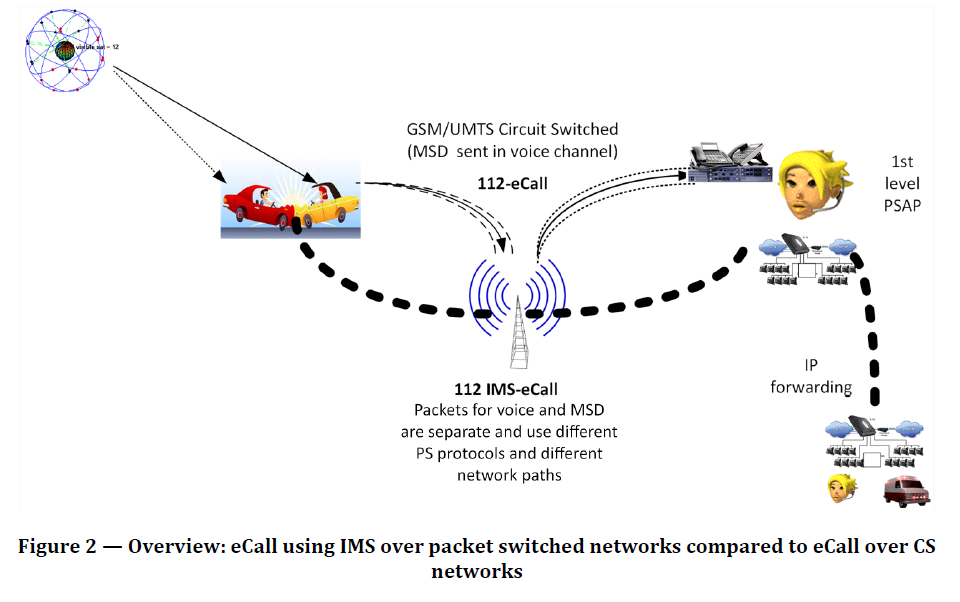
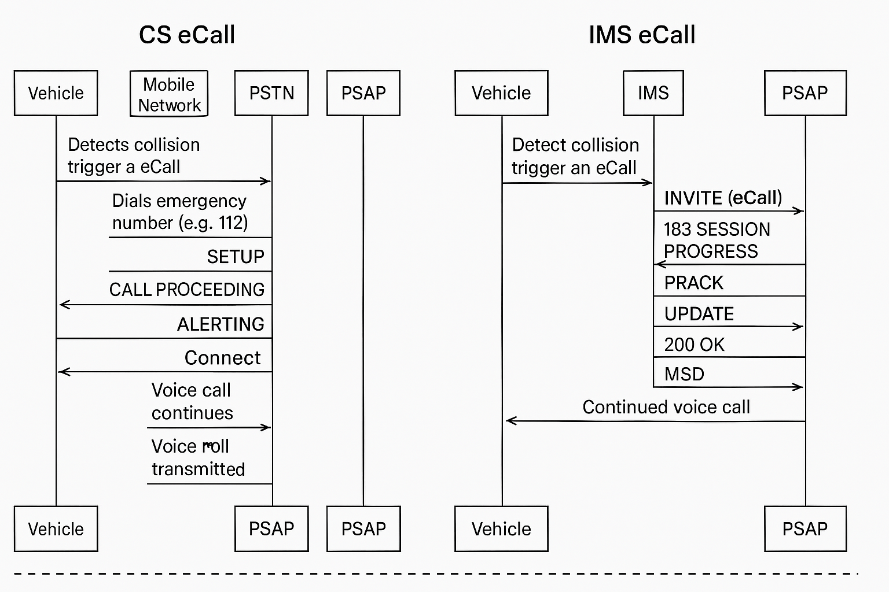
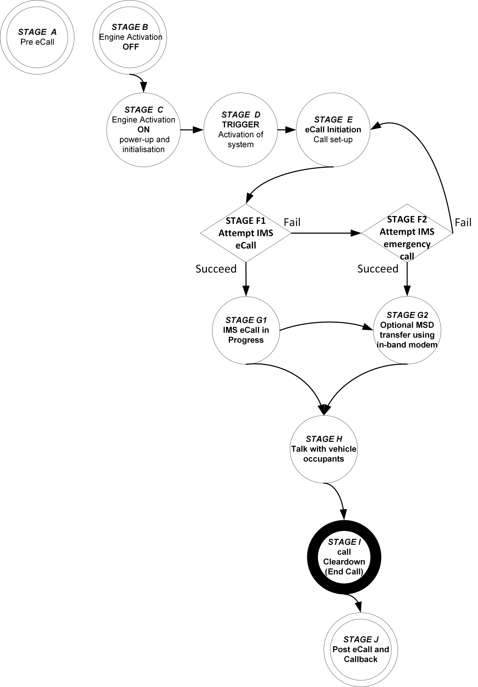
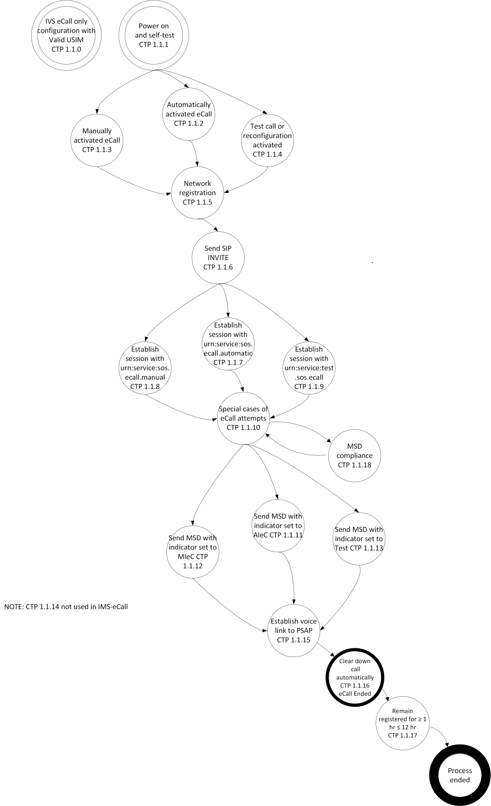
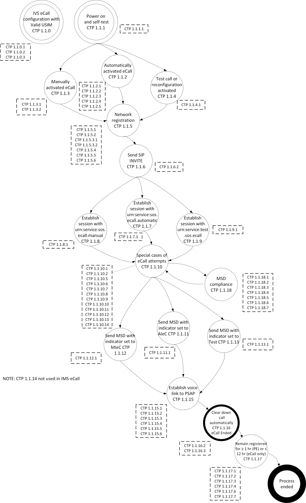

# ECALL-17240

用于IMS ECALL的一致性测试文档

## 以下是文档中与IVS（车载系统）相关的测试项：

- CTP 1.1.0.1 - 符合 ETSI TS 136 523、ETSI TS 138 523 和 ETSI TS 134 229 的要求
- CTP 1.1.0.2 - 验证有效的 SIM/USIM
- CTP 1.1.0.3 - 引擎关闭时不会自动触发 eCall
- CTP 1.1.1.1 - 开机自检
- CTP 1.1.2.1 - 自动触发的 eCall
- CTP 1.1.2.2 - 自动触发的 eCall 在进行中时不会因新触发而中断
- CTP 1.1.2.3 - 横向碰撞后自动触发的性能测试
- CTP 1.1.2.4 - 正面碰撞后自动触发的性能测试
- CTP 1.1.2.5 - 针对不同碰撞类型的自动触发性能测试
- CTP 1.1.3.1 - 手动触发的 eCall
- CTP 1.1.3.2 - 手动触发的 eCall 在进行中时不会因新触发而中断
- CTP 1.1.4.1 - 激活测试 eCall
- CTP 1.1.5.1 - 网络注册
- CTP 1.1.5.2 - 车辆乘员无法手动终止自动触发的 eCall
- CTP 1.1.5.3.1 - 车辆乘员无法手动终止手动触发的 eCall（超过T1计时器）
- CTP 1.1.5.3.2 - 车辆乘员可以手动终止手动触发的 eCall（未超过T1计时器）
- CTP 1.1.5.4 - 引擎关闭时自动触发的 eCall 不中断
- CTP 1.1.5.5 - 引擎关闭时手动触发的 eCall 不中断
- CTP 1.1.5.6 - eCall 优先于其他通信
- CTP 1.1.6.2 - 发送带有 MSD 的 SIP INVITE
- CTP 1.1.7.1 - 建立带有 urn:service:sos.ecall.automatic 的会话
- CTP 1.1.8.1 - 建立带有 urn:service:sos.ecall.manual 的会话
- CTP 1.1.9.1 - 建立带有 urn:service:test.sos.ecall 的会话
- CTP 1.1.10.1 - 在无网络可用时尝试 eCall
- CTP 1.1.10.2 - eCall 被中断后的重拨尝试（2分钟内完成）
- CTP 1.1.10.5 - 在有限服务条件下不尝试测试 eCall
- CTP 1.1.10.6 - eCall 被拒绝并确认 MSD 后仍保持网络注册
- CTP 1.1.10.7 - eCall 被拒绝并收到负面的 AL-ACK 后的重拨尝试
- CTP 1.1.10.8 - eCall 被拒绝并无 AL-ACK 时的重拨尝试
- CTP 1.1.10.9 - eCall 未被应答时的重拨尝试
- CTP 1.1.10.10 - 初始 MSD 收到负面的 AL-ACK
- CTP 1.1.10.11 - 初始 MSD 无 AL-ACK
- CTP 1.1.10.12 - 当无 IMS eCall 支持指示器的网络时尝试 IMS 紧急呼叫
- CTP 1.1.10.13 - 当无 IMS eCall 支持指示器的网络时尝试 eCall
- CTP 1.1.10.14 - 如果初始 MSD 未被确认，IVS 记录日志
- CTP 1.1.11.1 - 发送标识自动 eCall 激活的 MSD
- CTP 1.1.12.1 - 发送标识手动 eCall 激活的 MSD
- CTP 1.1.13.1 - 发送标识测试 eCall 激活的 MSD
- CTP 1.1.15.1 - 建立语音连接
- CTP 1.1.15.2 - eCall 进行中接收到新的或更新的 MSD
- CTP 1.1.15.3 - eCall 进行中，初始 MSD 收到负面的 AL-ACK 后接收到新的或更新的 MSD
- CTP 1.1.15.4 - eCall 进行中，初始 MSD 收到负面的 AL-ACK 且通过带内调制解调器传输 MSD 后接收到新的或更新的 MSD
- CTP 1.1.15.5 - eCall 进行中，初始 MSD 无 AL-ACK 后接收到新的或更新的 MSD
- CTP 1.1.15.6 - eCall 进行中，初始 MSD 无 AL-ACK 且通过带内调制解调器传输 MSD 后接收到新的或更新的 MSD
- CTP 1.1.16.2 - T2 定时器到期后 IVS 清除 eCall
- CTP 1.1.16.3 - IVS 记录最近的 eCall
- CTP 1.1.17.1 - IVS 允许并能够应答回呼
- CTP 1.1.17.2 - 异常终止情况下 IVS 应答回呼
- CTP 1.1.17.3 - 回呼期间 MSD 传输
- CTP 1.1.17.4 - 保持网络注册至少 1 小时
- CTP 1.1.17.6 - MSD 被确认后异常终止时不重拨
- CTP 1.1.17.7 - 备用电池容量验证
- CTP 1.1.18.1 - 符合 MSD 版本 3
- CTP 1.1.18.2 - 收到负面 AL-ACK 后通过带内调制解调器传输 MSD
- CTP 1.1.18.3 - 无 AL-ACK 后通过带内调制解调器传输 MSD
- CTP 1.1.18.4 - 符合 ETSI TS 126 269
- CTP 1.1.18.5 - 使用 IPv4 传输 MSD
- CTP 1.1.18.6 - 使用 IPv6 传输 MSD
- CTP 1.1.18.7 - 符合 Euro NCAP TB 040:2022 的附加数据要求

## CS VS IMS

| 项目     | IMS(IP-Multimedia Subsystem)    | CS                    |
| -------- | ------------------------------- | --------------------- |
| 架构     | 分组交换（IP）                  | 电路交换              |
| 网络代际 | 4G / 5G                         | 2G / 3G               |
| 语音质量 | 高清语音（HD），支持EVS         | 窄带语音              |
| 数据能力 | 同时支持数据 + 语音             | 通话时数据能力有限    |
| 业务能力 | VoLTE/VoNR、视频、RCS、NG eCall | 语音、SMS、传统 eCall |
| 建立速度 | 更快                            | 较慢                  |
| 未来趋势 | 主流、持续发展                  | 正在淘汰              |

## CS eCall VS IMS eCall

eCall 的基本目标一样：**自动呼叫 PSAP 并发送 MSD（最小数据集）。**
但流程因底层网络（CS vs IMS）不同而完全不一样。

1. eCall概览，图片来源：[EN 17240]

    

1. 流程对比图

    ```txt
    CS eCall（2G/3G）                    IMS eCall（4G/5G）

    车辆触发 eCall                      车辆触发 eCall
        │                                     │
    拨打 112（CS）                     发送 SIP INVITE（IMS）
        │                                     │
    CS 建立即时电路                    IMS 上建立 VoLTE 语音
        │                                     │
    PSAP 接起语音                      PSAP 接起语音
        │                                     │
    麦克风静音+调制解调器发送MSD        IP 信道传输 MSD（更快）
        │                                     │
    恢复语音对话                        语音通道继续通话
    ```

1. 关键差异总结表

    项目| CS eCall | IMS eCall（NG eCall）
    -|-|-
    网络 | 2G/3G（CS） | 4G/5G（IMS）
    呼叫建立方式 | 拨号 112 | SIP INVITE（带 eCall 标识）
    MSD 传输方式 | 语音中的调制解调器（in‑band modem） | IP 通道（更快更可靠）
    建立速度 | 慢 | 快|
    功能扩展性 | 有限 | 强（可扩展媒体）
    将来趋势 | 逐步淘汰 | 全面推进

1. 协议层面技术对比：SIP vs MAP/ISUP

    特性 | CS eCall | IMS eCall（NG）
    -|-|-
    呼叫信令 | ISUP(SS7) | SIP(IMS)
    移动管理 | MAP(HLR/VLR) | Diameter (HSS/UDM)
    路由控制 | MSC | E-CSCF
    位置信息 | MAP PSL | LPP / SIP-HELD / Diameter
    MSD传输  | In-band modem(音频调制) | IP 数据通道(IMS-DC)
    速率     | 极低 | 高得多（可靠+可扩展）
    网络依赖 | 2G/3G CS | LTE/5G全IP

1. 时序图对比

    

    PSTN： Public Switched Telephone Network(公用电话交换网 / 固话电话网络), 它是传统电路交换语音的**中转与路由网络**

## 状态切换图



### STAGE F1 VS STAGE F2

#### STAGE F1 — Attempt IMS‑eCall

- 动作：IVS 尝试建立一个 **正式的 IMS eCall**

- 信令特征：
  - 使用 eCall 专用 URN：
    - urn:service:sos.ecall.automatic
    - urn:service:sos.ecall.manual
  - **SIP INVITE 中包含 MSD（Minimum Set of Data）**

- 用途：这是 eCall 的正常工作路径

- 前提条件：PLMN 必须支持**IMS eCall support indicator (ECL)**

- 测试重点：
  - SIP INVITE 编码
  - MSD 的封装与传输
  - PSAP 的 AL‑ACK（MSD 成功解析）流程

此阶段代表**符合 EN 17184 IMS eCall 规范的“正宗 eCall”**。

#### STAGE F2 — Attempt IMS Emergency Call

- 动作：IVS 尝试建立**普通 IMS 紧急呼叫（Non‑eCall IMS Emergency Call）**

- 信令特征：
  - 使用普通 IMS 紧急 URN，例如：
    - urn:service:sos
  - **不包含 MSD**（或 MSD 不作为 eCall MSD 处理）

- 触发原因：
  - 网络**不支持 IMS eCall indicator (ECL)**
  - 无法使用 eCall URN
  - 前一个阶段（F1）无法建立 eCall（fallback 流程）

- 用途：作为**eCall fallback**，保证紧急呼叫仍可完成

- 测试重点：
  - fallback 机制
  - 网络选择
  - IMS emergency 注册流程
  - SIP INVITE 无 eCall MSD

此阶段代表**eCall 失败时的“备用紧急呼叫路径”**。

#### 对比总结表

项目| STAGE F1 | STAGE F2
-|-|-
呼叫类型| IMS eCall | IMS emergency call
使用的 URN | eCall URN（automatic / manual）  | 普通 SOS URN
MSD 是否发送| 是，必须发送| 否（或不按 eCall 格式处理）
触发原因| 正常 eCall 流程 | IMS eCall 不可用的 fallback
依赖网络能力| 需要 IMS eCall 支持（ECL）| 不需要
测试意图| 验证 eCall 正常系统流程 | 验证 fallback 是否合规

简单理解方式:

- F1 = 有 MSD 的 eCall
- F2 = 没有 MSD 的普通 IMS 紧急呼叫（fallback）

### STAGE G1 VS STAGE G2

G1与G2的关键差异：

- 👉 在 G1 中，语音通道不参与 MSD。
- 👉 在 G2 中，语音通道是 MSD 的“传输通道”。

**G2** 模式使用的是类似 `CS eCall` 的 **In‑band Modem** 调制方式，但其语音通道仍然运行在 **IMS**（VoLTE/VoNR）的 **RTP** 音频承载上，而非 **CS Domain**。因此 **G2** 是 **IMS eCall** 的 **fallback** 机制，而不是回退到 **CS eCall**。

**In‑band modem 是极端情况下仍能工作的“最后保险”**。

因为它满足以下四个“极端存活条件”：

1. 只要还能打通电话（有语音），就能传 MSD (语音是所有紧急场景中唯一“几乎不会失败”的承载方式)
1. 不依赖 IMS、SIP、SDP、AL‑ACK、网络能力、PSAP 软件支持
1. 跨 2G/3G/4G/5G 所有语音环境可用
1. 即使高级功能全失败（IMS 数据层全挂），仍能用调制音发送 MSD
1. In‑band modem 数据是“自包含、不可被运营商篡改”的（语音通道的调制音是不可被改动的）

### G与F的关系

- F = 呼叫建立阶段（Attempt）
- G = 呼叫已建立阶段（In-progress）

> - F1 是“尝试 IMS eCall（带 MSD）”，
> - G1 是“一旦建立成功后的 IMS eCall（MSD 已由 PSAP ACK）”。
> - F2 是“尝试普通 IMS Emergency Call（不带 eCall 特性）”，
> - G2 是“IMS语音通路建立后用 in-band modem 发送 MSD 的 fallback 模式”。

## 每个阶段的测试项

Table 8 shows the ’Test Suite Structure’ (TSS).里面有更详细的各stage的测试项




## IMS-eCall timers

Name | Origin | Description |备注|作用
-|-|-|-|-
T1| IVS| Manually initiated eCall (MIeC) false triggering cancellation period|手动触发 eCall（MIeC）的误触发取消时限 | 呼叫前, 允许用户撤销误触发
T2 | IVS | IVS Call Cleardown Fallback Timer (CCFT) | IVS 通话结束后备定时器; <br>当 CCFT 到期后，即使没有收到明确的清除指示，IVS 也必须主动终止 eCall 通话<br> 是 IVS 侧用于**防止 eCall 通话“卡住不结束”的安全兜底机制**<br>CCFT != “最大通话时长” 而是 CCFT == “最大不确定状态容忍时间” | 呼叫后, 防止通话异常悬挂
T9 | IVS | IVS NAD minimum network registration period | IVS NAD 最短网络注册保持周期 | 呼叫准备阶段, 保证网络已就绪
T10 | IVS | IVS NAD network `Deregistration Fallback Timer' (DFT)| IVS NAD 网络注销延迟定时器 | 呼叫结束后，网络不要马上断掉，给系统收尾、确认、恢复留时间

```text
IVS 上电 / 事故检测
        │
        │  网络注册
        ▼
     ┌────────┐
     │  T9    │  最小网络注册保持期（准备阶段保证网络）
     └────────┘
        │
        │  呼叫触发前
        ▼
┌───────────────┐
│      T1       │  MIeC误触发取消期（防误触）
└───────────────┘
        │
        │  eCall 建立
        ▼
┌───────────────┐
│ MSD Tx Timer  │  MSD 发送 / 重试 / 等待
└───────────────┘
        │
        │  等待确认
        ▼
┌───────────────┐
│ AL‑ACK Wait   │  应用层确认等待
└───────────────┘
        │
        │  通话进行中
        ▼
┌───────────────┐
│ T2    CCFT    │  通话清除后备定时器（兜底结束）
└───────────────┘
        │
        │  通话结束
        ▼
┌───────────────┐
│ T10           │  网络注销延迟期（善后阶段）
└───────────────┘
        │
        ▼
  NAD 允许退网 / 进入低功耗
```
