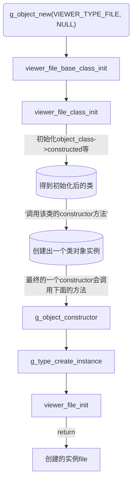

# [GObject](https://docs.gtk.org/gobject/concepts.html)
- [GObject](#gobject)
  - [The GLib Dynamic Type System](#the-glib-dynamic-type-system)
  - [在头文件中创建一个导出新类型的约定](#在头文件中创建一个导出新类型的约定)
  - [不同类型的注册方法：](#不同类型的注册方法)
    - [1. 不可实例化，无类结构的基本类型数据的注册--**`gchar`**](#1-不可实例化无类结构的基本类型数据的注册--gchar)
    - [2. 注册可实例化的有类型结构类型 : **对象(object)**](#2-注册可实例化的有类型结构类型--对象object)
    - [3. 注册不能实例化的有类结构的类型： **接口(interface)**](#3-注册不能实例化的有类结构的类型-接口interface)
  - [GObject的实例化](#gobject的实例化)
    - [对象的实例化](#对象的实例化)

## The GLib Dynamic Type System

在程序的类型系统中注册新的 **GType** 需要使用以下几个C函数中的一个 ,它们在gtype.h中定义并在gtype.c中实现：
 - `g_type_register_static()` 
 - `g_type_register_dynamic()`  
 - `g_type_register_fundamental()` : 用于创建基础类型的类（如int, long等），基本用不上
 - `g_type_add_interface_static()` : 为类添加接口
```c
typedef struct _GTypeInfo               GTypeInfo;
struct _GTypeInfo
{
  /* interface types, classed types, instantiated types */
  guint16                class_size; //类大小

  GBaseInitFunc          base_init; //C++ constructor
  GBaseFinalizeFunc      base_finalize; //C++ destructor

  /* classed types, instantiated types */
  GClassInitFunc         class_init; //C++ constructor
  GClassFinalizeFunc     class_finalize; //C++ destructor
  gconstpointer          class_data;

  /* instantiated types */
  guint16                instance_size; // C++ parameter to new, 实例的大小
  guint16                n_preallocs; // C++ type of new operator,实例化策略
  GInstanceInitFunc      instance_init; // 初始化实例方法

  /* value handling */
  const GTypeValueTable *value_table;//  C++ copy， 使用g_value_copy(src, dst)时调用此方法,所以所有类都可通过GValue来copy数据
};

GType
g_type_register_static (GType            parent_type,
                        const gchar     *type_name,
                        const GTypeInfo *info,
                        GTypeFlags       flags);

GType
g_type_register_fundamental (GType                       type_id,
                             const gchar                *type_name,
                             const GTypeInfo            *info,
                             const GTypeFundamentalInfo *finfo,
                             GTypeFlags                  flags);

//上面是对象的，以下是接口的
typedef struct _GInterfaceInfo               GInterfaceInfo;
struct _GInterfaceInfo
{
  GInterfaceInitFunc     interface_init;
  GInterfaceFinalizeFunc interface_finalize;
  gpointer               interface_data;
};
g_type_add_interface_static (GType dest_type, GType if_type, GInterfaceInfo *if_info)


```

## 在头文件中创建一个导出新类型的约定
- 函数名命名规则：`prefix_object_method` ， **prefix**为库名/工程名，类似namespace; **object**为对象名; **method**为方法名，(eg:`viewer_file_save`)
- 创建一个命名为`PREFIX_TYPE_OBJECT` 宏，该宏总是返回与其相联类型的GType,宏的实现方法名为`prefix_object_get_type`, (eg: `#define VIEWER_TYPE_FILE viewr_file_get_type()`)
-  使用 `G_DECLARE_FINAL_TYPE` 或 `G_DECLARE_DERIVABLE_TYPE` 为您的对象定义各种其他约定宏，有下面这些：
    - `PREFIX_OBJECT (obj)`： 返回`PrefixObject`类型的对象指针, 用于静态或动态地安全地强制转化目标类型，在编译GLib库时可以禁用动态类型检查
    - `PREFIX_OBJECT_CLASS (klass)`： 与上面相似，返回`PrefixObjecClass`类的类结构指针
    - `PREFIX_IS_OBJECT (obj)`: 返回布尔类型，用于判断obj是否为非空的目标对象
    - `PREFIX_IS_OBJECT_CLASS (klass)`: 同上，是否为目标类指针
    - `PREFIX_OBJECT_GET_CLASS (obj)`: 它返回与给定obj关联的类指针
```c

#define VIEWER_TYPE_FILE viewer_file_get_type()
G_DECLARE_FINAL_TYPE (ViewerFile, viewer_file, VIEWER, FILE, GObject)


#if 1
//使用下面的宏定义一个新class
G_DEFINE_TYPE (ViewerFile, viewer_file, G_TYPE_OBJECT)
//如果是接口的定义使用G_DECLARE_INTERFACE，可参详下面的接口注册部分
#else
//如果有特殊化的需求，也可以手动实现如下函数来新建一个class
GType viewer_file_get_type (void)
{
  static GType type = 0;
  if (type == 0) {
    const GTypeInfo info = {
      /* You fill this structure. */
    };
    type = g_type_register_static (G_TYPE_OBJECT,
                                   "ViewerFile",
                                   &info, 0);
  }
  return type;
}
#endif
```
## 不同类型的注册方法：
### 1. 不可实例化，无类结构的基本类型数据的注册--**`gchar`**
```c
GTypeInfo info = {
  .class_size = 0,

  .base_init = NULL,
  .base_finalize = NULL,

  .class_init = NULL,
  .class_finalize = NULL,
  .class_data = NULL,

  .instance_size = 0,
  .n_preallocs = 0,
  .instance_init = NULL,

  .value_table = NULL,
};

static const GTypeValueTable value_table = {
  .value_init = value_init_long0,
  .value_free = NULL,
  .value_copy = value_copy_long0,
  .value_peek_pointer = NULL,

  .collect_format = "i",
  .collect_value = value_collect_int,
  .lcopy_format = "p",
  .lcopy_value = value_lcopy_char,
};

info.value_table = &value_table;

type = g_type_register_fundamental (G_TYPE_CHAR, "gchar", &info, &finfo, 0);

```
### 2. 注册可实例化的有类型结构类型 : **对象(object)**
以下是一个继承了`G_TYPE_OBJECT`的`ViewrFile`对象的注册示例
```c
typedef struct {
  GObject parent_instance;

  /* instance members */
  char *filename;
} ViewerFile;

typedef struct {
  GObjectClass parent_class;

  /* class members */

  /* the first is public, pure and virtual */
  void (*open)  (ViewerFile  *self,
                 GError     **error);

  /* the second is public and virtual */
  void (*close) (ViewerFile  *self,
                 GError     **error);
} ViewerFileClass;

#define VIEWER_TYPE_FILE (viewer_file_get_type ())

GType
viewer_file_get_type (void)
{
  static GType type = 0;
  if (type == 0) {
    const GTypeInfo info = {
      .class_size = sizeof (ViewerFileClass),
      .base_init = NULL,
      .base_finalize = NULL,
      .class_init = (GClassInitFunc) viewer_file_class_init,
      .class_finalize = NULL,
      .class_data = NULL,
      .instance_size = sizeof (ViewerFile),
      .n_preallocs = 0,
      .instance_init = (GInstanceInitFunc) viewer_file_init,
    };
    type = g_type_register_static (G_TYPE_OBJECT,
                                   "ViewerFile",
                                   &info, 0);
  }
  return type;
}

```
- 针对**对象**的初始化和销毁的总结如下：
  
  调用时机 |	被调用函数 |	函数的参数
  -|-|-
  首次针对目标类型调用`g_type_create_instance()`函数时 |	type’s `base_init` function |	On the inheritance tree of classes from fundamental type to target type. `base_init` is invoked once for each class structure.|
  | |target type’s `class_init` function| 	目标类型的类结构(On target type’s class structure)
  | |interface initialization, see the section called “Interface Initialization” |
  |对目标类每次调用`g_type_create_instance()`时|	target type’s `instance_init` function 	|对象的实例(On object’s instance)
  |对目标类最后一次调用`g_type_free_instance()`时 |	interface destruction, see the section called “Interface Destruction” 	|
  ||target type’s `class_finalize` function |	目标类型的类结构
  ||type’s `base_finalize` function |	On the inheritance tree of classes from fundamental type to target type. `base_finalize` is invoked once for each class structure.

### 3. 注册不能实例化的有类结构的类型： **接口(interface)**
通过`viewer_editable_get_type`注册了一个名为`ViewerEditable`的接口类型，它继承了`G_TYPE_INTERFACE`。所有接口都必须是继承树中G_TYPE_INTERFACE的子级。 下面的代码就是一个接口的申明举例：
```c
#define VIEWER_TYPE_EDITABLE viewer_editable_get_type ()

#if 1
G_DECLARE_INTERFACE (ViewerEditable, viewer_editable, VIEWER, EDITABLE, GObject)
#else
GType
viewer_editable_get_type (void)
{
  static gsize type_id = 0;
  if (g_once_init_enter (&type_id)) {
    const GTypeInfo info = {
      sizeof (ViewerEditableInterface),
      NULL,   /* base_init */
      NULL,   /* base_finalize */
      viewer_editable_default_init, /* class_init */
      NULL,   /* class_finalize */
      NULL,   /* class_data */
      0,      /* instance_size */
      0,      /* n_preallocs */
      NULL    /* instance_init */
    };
    GType type = g_type_register_static (G_TYPE_INTERFACE,
                                         "ViewerEditable",
                                         &info, 0);
    g_once_init_leave (&type_id, type);
  }
  return type_id;
}
#endif

struct _ViewerEditableInterface {
  GTypeInterface parent;

  void (*save) (ViewerEditable  *self,
                GError         **error);
};

void viewer_editable_save (ViewerEditable  *self,
                           GError         **error);

static void
viewer_editable_default_init (ViewerEditableInterface *iface)
{
  /* add properties and signals here, will only called once */
}                          
```
接口函数`viewer_editable_save`的实现如下：
```c
void
viewer_editable_save (ViewerEditable  *self,
                      GError         **error)
{
  ViewerEditableinterface *iface;

  g_return_if_fail (VIEWER_IS_EDITABLE (self));
  g_return_if_fail (error == NULL || *error == NULL);

  iface = VIEWER_EDITABLE_GET_IFACE (self);
  g_return_if_fail (iface->save != NULL);
  iface->save (self);
}

```
接口仅由一个结构定义，该结构必须包含 GTypeInterface 结构作为第一个成员。接口结构应该包含接口方法的函数指针。为每个接口方法定义辅助函数(helper function)是一种很好的风格,辅助函数仅只是简单的直接调用接口的方法：`viewer_editable_save`就是其中之一。如果没有特别的需求，直接使用宏`G_IMPLEMENT_INTERFACE`即可实现接口,如下所示代码，注册了一个实现了接口`ViewerEditable`的`ViewerFile`类
```c
static void
viewer_file_save (ViewerEditable *self)
{
  g_print ("File implementation of editable interface save method.\n");
}

static void
viewer_file_editable_interface_init (ViewerEditableInterface *iface)
{
  iface->save = viewer_file_save;
}
G_DEFINE_TYPE_WITH_CODE (ViewerFile, viewer_file, VIEWER_TYPE_FILE,
                         G_IMPLEMENT_INTERFACE (VIEWER_TYPE_EDITABLE,
                                                viewer_file_editable_interface_init))
```
否则你要自己实现`get_type`函数来注册一个继承自GObject并实现了对应接口类的GType
```c
static void
viewer_file_save (ViewerEditable *editable)
{
  g_print ("File implementation of editable interface save method.\n");
}

static void
viewer_file_editable_interface_init (gpointer g_iface,
                                     gpointer iface_data)
{
  ViewerEditableInterface *iface = g_iface;

  iface->save = viewer_file_save;
}

GType
viewer_file_get_type (void)
{
  static GType type = 0;
  if (type == 0) {
    const GTypeInfo info = {
      .class_size = sizeof (ViewerFileClass),
      .base_init = NULL,
      .base_finalize = NULL,
      .class_init = (GClassInitFunc) viewer_file_class_init,
      .class_finalize = NULL,
      .class_data = NULL,
      .instance_size = sizeof (ViewerFile),
      .n_preallocs = 0,
      .instance_init = (GInstanceInitFunc) viewer_file_init
    };

    const GInterfaceInfo editable_info = {
      .interface_init = (GInterfaceInitFunc) viewer_file_editable_interface_init,
      .interface_finalize = NULL,
      .interface_data = NULL,
    };

    type = g_type_register_static (VIEWER_TYPE_FILE,
                                   "ViewerFile",
                                   &info, 0);

    g_type_add_interface_static (type,
                                 VIEWER_TYPE_EDITABLE,
                                 &editable_info);
  }
  return type;
}

```

- 接口的初始化：当 **实现一个接口（无论是直接实现还是通过继承实现）** 的 **可实例化的类型**被第一次创建时,它的类首先如上一节[注册可实例化的有类型结构类型](#2-注册可实例化的有类型结构类型--对象object)所描述的初始化步骤被初始化，然后才开始初始化相关的实现接口
- 针对接口的初始化和销毁的总结如下：
  
Invocation time |	Function Invoked | 	Function’s parameters | 	Remark
|-|-|-|- |
First call to `g_type_create_instance()` for any type implementing interface |	interface’s `base_init` function |	On interface’s vtable |	Rarely necessary to use this. Called once per instantiated classed type implementing the interface.
First call to `g_type_create_instance()` for each type implementing interface |	interface’s `default_init` function 	| On interface’s vtable |	Register interface’s signals, properties, etc. here. Will be called once.
First call to `g_type_create_instance()` for any type implementing interface 	| implementation’s `interface_init` function |	On interface’s vtable 	| Initialize interface implementation. Called for each class that that implements the interface. Initialize the interface method pointers in the interface structure to the implementing class’s implementation.  
Last call to `g_type_free_instance()` for type implementing interface | interface’s `interface_finalize` function | On interface’s vtable | |
| | interface’s `base_finalize` function | On interface’s vtable | |


## GObject的实例化
上面讨论了动态类型系统的细节，GObject库还包含了名为`GObject`的基本类型的实现，GObject是一种基本的可实例化类型。它实现了
- 带引用计数的内存管理
- 实例的构造/销毁
- 通用的针对每个对象属性的一对set和get函数
- 易用的信号

所有使用 GLib 类型系统的 GNOME 库（如 GTK 和 GStreamer）都继承自 GObject，这就是为什么了解其工作原理的细节很重要的原因。
### 对象的实例化

`g_object_new()`系列函数可用于实例化从`GObject`基类型继承的任何`GType`,所有的这些函数都是为了确保类和实例可以被GLib类型系统正常的初始化，然后在某一时刻或另一个构造类方法中调用，用于以下目的：
 - 通过 `g_type_create_instance()` 分配和清除内存  
 - 通过构造属性初始化对象的实例  
    
`GObject`明确保证将所有类和实例成员（指向父级的字段除外）设置为零。一旦完成所有构造操作并设置构造属性后，就会调用类的构造方法（the constructed class method ），一个继承自`GObject`的对象可以重写（override）类的构造方法, `g_object_new()`调用到的方法及调用顺序如下表：
Invocation time |	Function invoked |	Function’s parameters |	Remark
|-|-|-|-|
|针对一个类首次调用`g_object_new()`时| 目标类的`base_init`方法 | 在从基本类型到目标类型的类的继承树上。 `base_init` 为每个类结构调用一次。| 实践中从来不会用到|
||目标类的`class_init`方法| 目标类的结构体| 在这里，您应该确保初始化或覆盖类方法（即，为每个类的方法分配其函数指针）并创建与您的对象关联的信号和属性。
||接口的`base_init`方法|On interface’s vtable|
||接口的`interface_init`方法|On interface’s vtable|
|每次对类调用`g_object_new()`时| 目标类的`constructor`方法：`GObjectClass->constructor` | 对象实例| 如果您需要以自定义方式处理构造属性，或实现单例类，请重写构造函数并确保在进行自己的初始化之前串链起对象的父类。否则，不要重写构造函数。
|| 类的`instance_init`方法 |在从基本类型到目标类型的类的继承树上。为每种类型提供的 `instance_init` 会为每个实例结构调用一次。|提供一个 instance_init 函数以在设置对象的构造属性之前对其进行初始化。  这是初始化 GObject 实例的首选方法。  此函数等效于 C++ 构造函数。
||目标类的`constructed`方法：`GObjectClass->constructed`|对象实例|如果您需要在设置所有构造属性后执行对象初始化步骤。  这是对象初始化过程的最后一步，仅当构造方法返回一个新的对象实例（而不是现有的单例）时才调用。


举例如下：
```c
#define VIEWER_TYPE_FILE viewer_file_get_type ()
G_DECLARE_FINAL_TYPE (ViewerFile, viewer_file, VIEWER, FILE, GObject)

struct _ViewerFile
{
  GObject parent_instance;

  /* instance members */
  char *filename;
  guint zoom_level;
};

/* will create viewer_file_get_type and set viewer_file_parent_class */
G_DEFINE_TYPE (ViewerFile, viewer_file, G_TYPE_OBJECT)

static void
viewer_file_constructed (GObject *obj)
{
  /* update the object state depending on constructor properties */

  /* Always chain up to the parent constructed function to complete object
   * initialisation. */
  G_OBJECT_CLASS (viewer_file_parent_class)->constructed (obj);
}

static void
viewer_file_finalize (GObject *obj)
{
  ViewerFile *self = VIEWER_FILE (obj);

  g_free (self->filename);

  /* Always chain up to the parent finalize function to complete object
   * destruction. */
  G_OBJECT_CLASS (viewer_file_parent_class)->finalize (obj);
}

static void
viewer_file_class_init (ViewerFileClass *klass)
{
  GObjectClass *object_class = G_OBJECT_CLASS (klass);

  object_class->constructed = viewer_file_constructed;
  object_class->finalize = viewer_file_finalize;
}

static void
viewer_file_init (ViewerFile *self)
{
  /* initialize the object */
}

```
当调用`ViewerFile *file = g_object_new (VIEWER_TYPE_FILE, NULL);`时，发生如下调用


