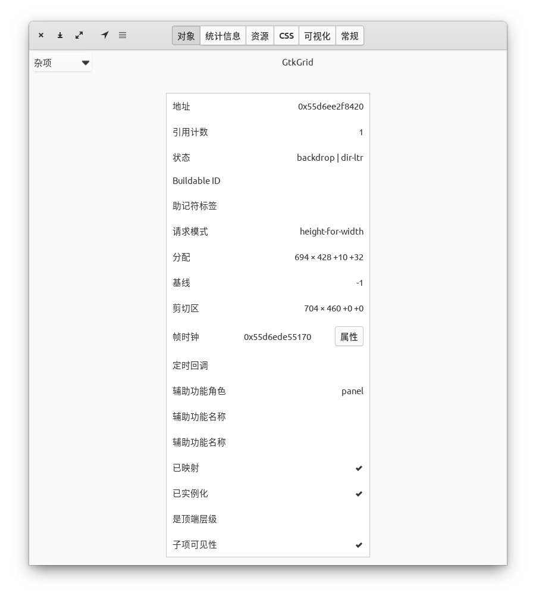
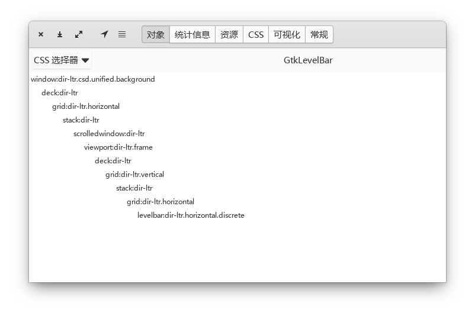
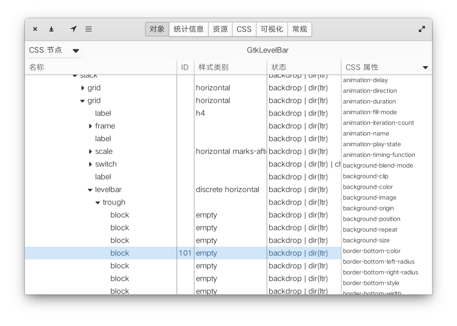
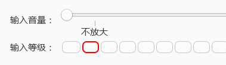

- [开启调试功能](#开启调试功能)
- [miscellaneous](#miscellaneous)
- [css](#css)
- [CSS Node](#css-node)
- [CSS 选择器](#css-选择器)
## 开启调试功能
1. 快捷方式：
   - step 1:
      - normal: `gsettings set org.gtk.Settings.Debug enable-inspector-keybinding true`
      - flatpak 应用
        ```sh
        flatpak run --command='sh' org.gnome.Polari
        gsettings set org.gtk.Settings.Debug enable-inspector-keybinding true
        ```
    - step 2: 按快捷键-->**"Control-shift-d/i"**

2. 直接命令行启动：`GTK_DEBUG=interactive your-app`

## miscellaneous

```xml
H_______________________________________________I________M_________M'
|                                  |            :        |scroll.w :
|                             margin-top        :        |         :
|            (x,y) a_______________|____________b        |         :
|                  |          (allocation)      |        |         :
|            (clip | erea)                      |        |         :
|                  |                |           |        |         :
|                  |    <—w—>       h           | ——margin-end——   :
|                  |                |           |        |         :
| ——margin-start—— |                            |        |         :
|..................|____________________________|        |         :
|J                 d            |               c        |         :
|                               |                        |         :
|                            bottom                      |         :
|______________________________ | _______________________|         :
|K                              |                         L        : 
|                               |                                  :
|                               |                 (scroll erea)    :
|scroll.h                       |                                  :
|...............................|..................................:
K'                                                               L'

```
- allocation erea: 图中abcd矩形
- clip erea:k图中HIcJ矩形 
- parent window: HMLK矩形, L`要么与L重合，要么出来滚动窗

1. 分配区(选中控件后闪色的区块)
    - 定义： width x height + x-offset + y-offset (简写为：w*h+x+y)
    - 说明: 
      - x: 分配区左侧到父窗口的空隙间距(即 margin-star t值)
      - y: 分配区顶部到父窗口的空隙间距(即 margin-top值)
      - w: `p.w = margin.start + w + (margin.end - scroll.w)`; 选中分配区的宽，scroll.w=(parent.w-w-x)，要想不出现scrolledWindow水平滚动条，则需scroll.w=0
      - h: `p.h=margin.top + h + (margin.bottom-scroll.h)`;选中分配区的高，scroll.h=(parent.h-h-y)，要想不出现滚动条，需scroll.h=0。
    - 总结：分配宽+margin.start+margin.end 即为要在父窗口中分配显示的宽度,如果此值超过父窗口的宽度，当父窗口不固定则扩大宽度，如果固定则从margin.end边缘向左的部分显示区域被遮挡;高度亦如是。
2. 剪切区:
    - 定义： width x height + x-offset + y-offset (cw*ch+cx+cy)
    - 说明: 
      - cx: margin-start value
      - cy: margin-top value
      - cw:  cw + margin-end = parent.cw 
      - ch:  ch + margin-bottom = parent.ch
3. 分配区和剪切区的关系：
   - 满足：cw=w+x, ch=h+y
   - example
        ```note
        - 无滚动情况：
        parent-allo: 704x575+0+0
        parent-clip: 704x575+0+0

        child-allo: 634x465+30+50
        child-clip: 664x515+0+0
        child-margin: start:30,end:40,top:50,bottom:60

        allo: 704=634+30+40   575=465+50+60
        clip: 704=664+40      575=515+60

        - 有上下滚动条的情况：（高度不够）
        parent-allo:704x465+0+0
        parent-clip:704x465+0+0

        child-allo:672x404+16+32
        child-clip:688x436+0+0
        child-margin: start:16,end:16,top:32,bottom:32

        allo: 704=672+16+16     465=404+32+29
        clip: 704=688+16        465=436+29
        因为29<32，所以垂直方向出现滚动条，把margin-bottom调整为29即无  
        ```

## css
selector
css node
- scss code :
  ```scss
  levelbar {
      &.discrete {
          &.horizontal {
              block {
                  min-width: rem(10px);
              }
          }
  }
  ```
- inspector css :
  ```css
  levelbar.discrete.horizontal block {
    min-width:10px;
  }
  /* 另一种方法使用CSSnode名称，不用样式名
  levelbar trough block {
    min-width:10px;
  }
  */

  #101 {
    min-width:24px;
    border:2px solid red;
  }
  stack-switcher :checked {
    background-color:#00ffff;
  }

  ```
- #ID： 选择某个控件指定，效果如下图, 其余的block width=10
  
- css node节点名称： 在inspector的css里如果是名称则直接使用，有级联关系的中间使用空格分开
- 样式类别： 图中的样式类别就代表着当前所用的样式类名classname （eg: .horizontal, .discrete）
- 状态： 代表当前控件的状态是disable,active,backdrop,checked等，状态以`classname:status`书写, 
  - 在inspector的css中书写时**注意类名与状态符：中间留空格**，`.classname :status`。
  - 取反状态使用`:not(status)`
## CSS Node
> GTK 通过将选择器与节点树进行匹配来应用样式表中的样式信息。  树中的每个节点都有一个名称、一个状态和可能的样式类。  每个节点的子节点是线性排序的。
> 每个小部件都有一个或多个这样的 CSS 节点，并确定它们的名称、状态、样式类以及它们在整个节点树中作为子级和兄弟级的布局方式。  每个小部件的文档解释了它有哪些 CSS 节点。
- The CSS nodes of a GtkScale
```xml
scale[.fine-tune]
├── marks.top
│   ├── mark
┊   ┊
│   ╰── mark
├── trough
│   ├── slider
│   ├── [highlight]
│   ╰── [fill]
╰── marks.bottom
    ├── mark
    ┊
    ╰── mark

```
## [CSS 选择器](https://www.w3school.com.cn/cssref/css_selectors.asp)
选择器 |	例子 |	例子描述
:-|:-|-
.class |	.intro |	选择 class="intro" 的所有元素。
.class1.class2 	|.name1.name2 |	选择 class 属性中同时有 name1 和 name2 的所有元素。
.class1 .class2 |	.name1 .name2 |	选择作为类名 name1 元素后代的所有类名 name2 元素。
#id |	#firstname |	选择 id="firstname" 的元素。
\* |	* |	选择所有元素。
element |	p |	选择所有 \<p\> 元素。
element.class |	p.intro |	选择 class="intro" 的所有 \<p\> 元素。
element,element |	div, p |	选择所有 \<div\> 元素和所有 \<p\> 元素。
element element |	div p |	选择 \<div\> 元素内的所有 \<p\> 元素。
element>element |	div > p |	选择父元素是 \<div\> 的所有 \<p\> 元素。
element+element |	div + p |	选择紧跟 \<div\> 元素的首个 \<p\> 元素。
element1~element2 |	p ~ ul |	选择前面有 \<p\> 元素的每个 \<ul\> 元素。
[attribute] |	[target] |	选择带有 target 属性的所有元素。
[attribute=value] |	[target=_blank] |	选择带有 target="_blank" 属性的所有元素。
[attribute~=value] |	[title~=flower] |	选择 title 属性包含单词 "flower" 的所有元素。
[attribute\|=value] |	[lang\|=en] |	选择 lang 属性值以 "en" 开头的所有元素。
[attribute^=value] |	a[href^="https"] |	选择其 src 属性值以 "https" 开头的每个 \<a\> 元素。
[attribute$=value] |	a[href$=".pdf"] |	选择其 src 属性以 ".pdf" 结尾的所有 \<a\> 元素。
[attribute*=value] |	a[href*="w3schools"] |	选择其 href 属性值中包含 "abc" 子串的每个 \<a\> 元素。
:active |	a:active |	选择活动链接。
::after |	p::after |	在每个 \<p\> 的内容之后插入内容。
::before |	p::before |	在每个 \<p\> 的内容之前插入内容。
:checked |	input:checked |	选择每个被选中的 \<input\> 元素。
:default |	input:default |	选择默认的 \<input\> 元素。
:disabled |	input:disabled |	选择每个被禁用的 \<input\> 元素。
:empty |	p:empty |	选择没有子元素的每个 \<p\> 元素（包括文本节点）。
:enabled |	input:enabled |	选择每个启用的 \<input\> 元素。
:first-child |	p:first-child |	选择属于父元素的第一个子元素的每个 \<p\> 元素。
::first-letter |	p::first-letter |	选择每个 \<p\> 元素的首字母。
::first-line |	p::first-line |	选择每个 \<p\> 元素的首行。
:first-of-type |	p:first-of-type |	选择属于其父元素的首个 \<p\> 元素的每个 \<p\> 元素。
:focus |	input:focus |	选择获得焦点的 input 元素。
:fullscreen |	:fullscreen |	选择处于全屏模式的元素。
:hover |	a:hover |	选择鼠标指针位于其上的链接。
:in-range |	input:in-range |	选择其值在指定范围内的 input 元素。
:indeterminate |	input:indeterminate |	选择处于不确定状态的 input 元素。
:invalid |	input:invalid |	选择具有无效值的所有 input 元素。
:lang(language) |	p:lang(it) |	选择 lang 属性等于 "it"（意大利）的每个 \<p\> 元素。
:last-child |	p:last-child |	选择属于其父元素最后一个子元素每个 \<p\> 元素。
:last-of-type |	p:last-of-type |	选择属于其父元素的最后 \<p\> 元素的每个 \<p\> 元素。
:link |	a:link |	选择所有未访问过的链接。
:not(selector) |	:not(p) |	选择非 \<p\> 元素的每个元素。
:nth-child(n) |	p:nth-child(2) |	选择属于其父元素的第二个子元素的每个 \<p\> 元素。
:nth-last-child(n) |	p:nth-last-child(2) |	同上，从最后一个子元素开始计数。
:nth-of-type(n) |	p:nth-of-type(2) |	选择属于其父元素第二个 \<p\> 元素的每个 \<p\> 元素。
:nth-last-of-type(n) |	p:nth-last-of-type(2) |	同上，但是从最后一个子元素开始计数。
:only-of-type |	p:only-of-type |	选择属于其父元素唯一的 \<p\> 元素的每个 \<p\> 元素。
:only-child |	p:only-child |	选择属于其父元素的唯一子元素的每个 \<p\> 元素。
:optional |	input:optional |	选择不带 "required" 属性的 input 元素。
:out-of-range |	input:out-of-range |	选择值超出指定范围的 input 元素。
::placeholder |	input::placeholder |	选择已规定 "placeholder" 属性的 input 元素。
:read-only |	input:read-only |	选择已规定 "readonly" 属性的 input 元素。
:read-write |	input:read-write |	选择未规定 "readonly" 属性的 input 元素。
:required |	input:required |	选择已规定 "required" 属性的 input 元素。
:root |	:root |	选择文档的根元素。
::selection |	::selection |	选择用户已选取的元素部分。
:target |	#news:target |	选择当前活动的 #news 元素。
:valid |	input:valid |	选择带有有效值的所有 input 元素。
:visited |	a:visited |	选择所有已访问的链接。
