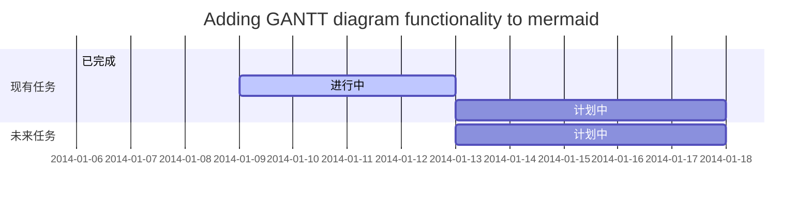
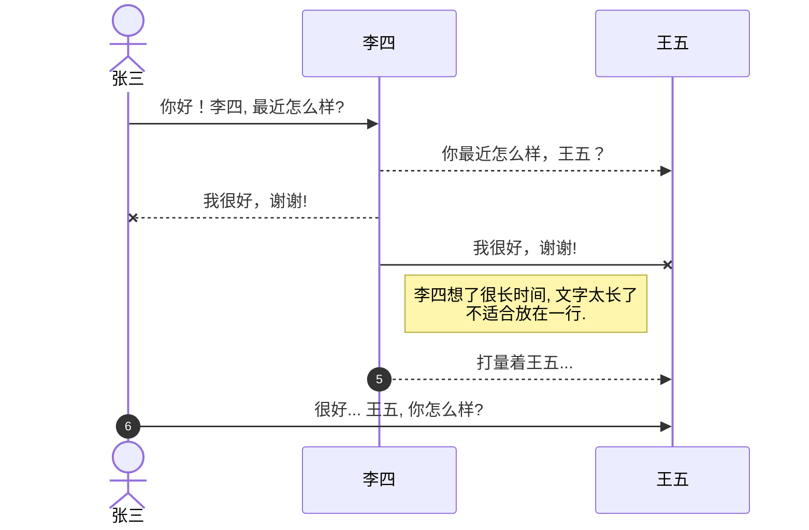
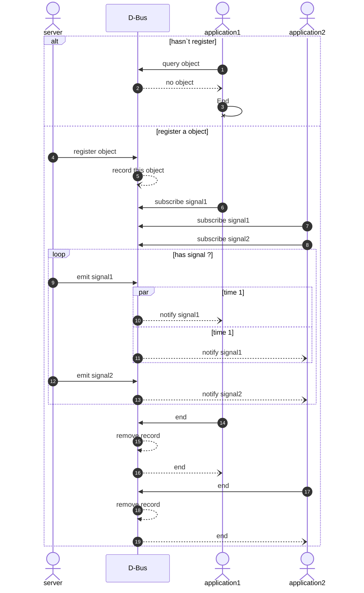
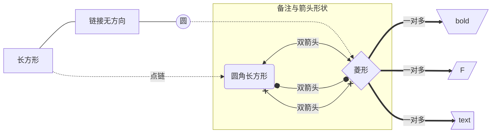
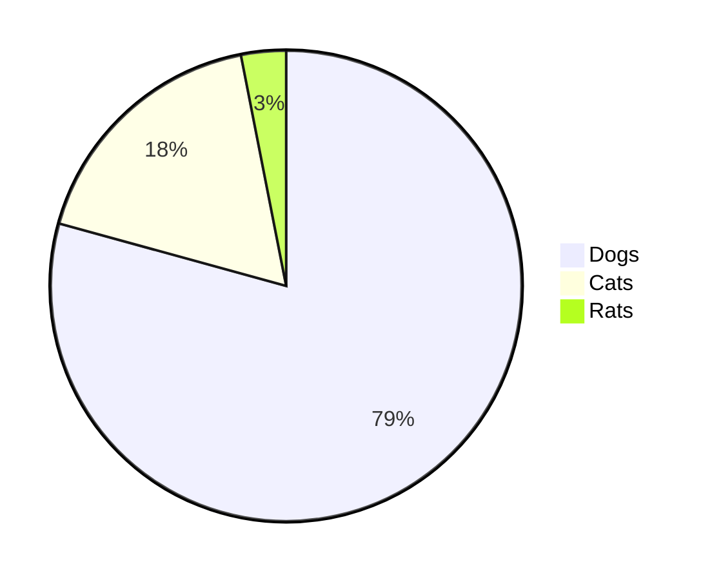
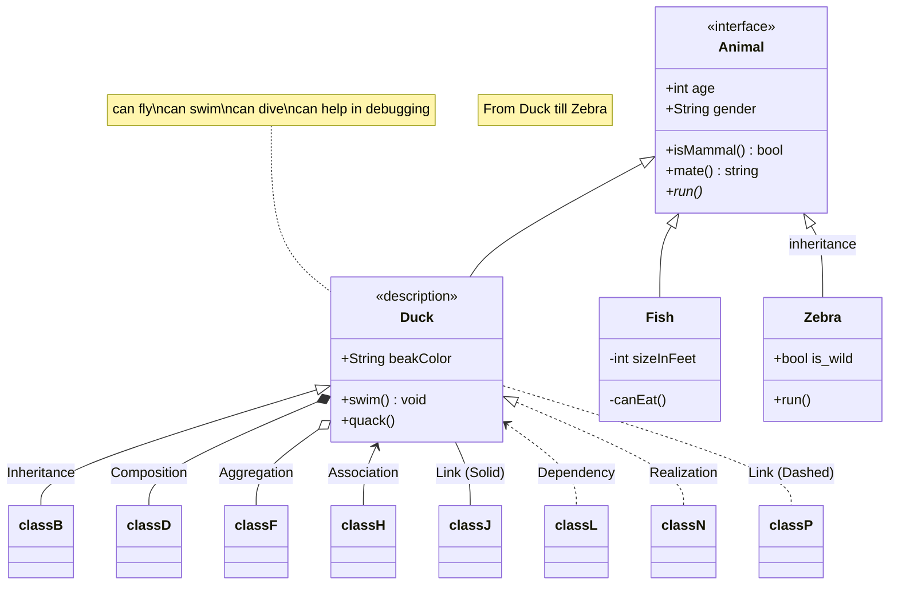

# MERMAID

Mermaid: <https://mermaid.js.org/intro>

## mermaid example

## 甘特图-gantt



## 时序图-Sequence

example 1



exmaple 2



## 流程图-flowchart



## 饼图-pie



## 函数类图-[Class diagram](https://mermaid.js.org/syntax/classDiagram.html#syntax)



## mindmap

<!-- ```mermaid
mindmap
  root((mindmap))
    Origins
      Long history
      ::icon(fa fa-book)
      Popularisation
        British popular psychology author Tony Buzan
    Research
      On effectiveness<br/>and features
      On Automatic creation
        Uses
            Creative techniques
            Strategic planning
            Argument mapping
    Tools
      Pen and paper
      Mermaid
``` -->
