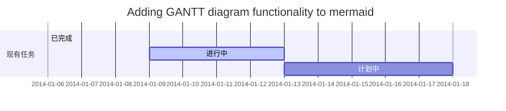
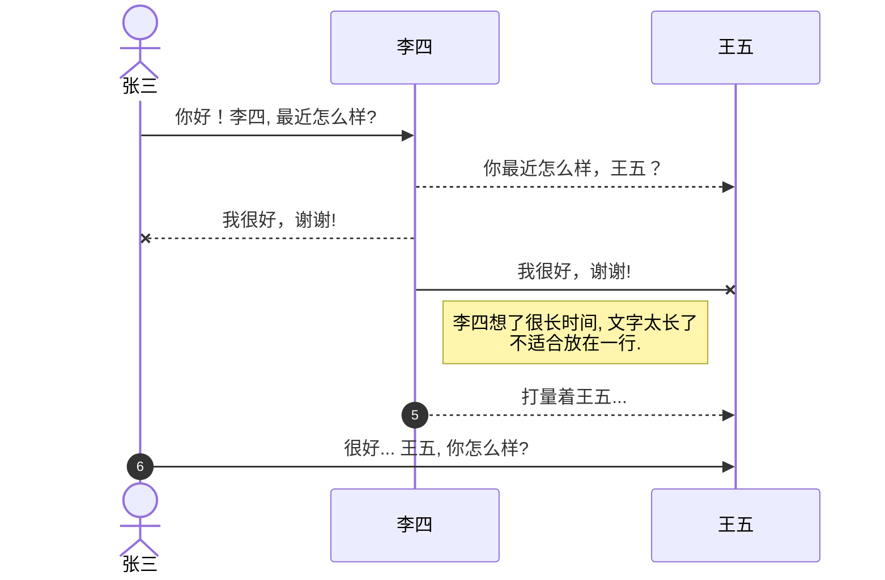
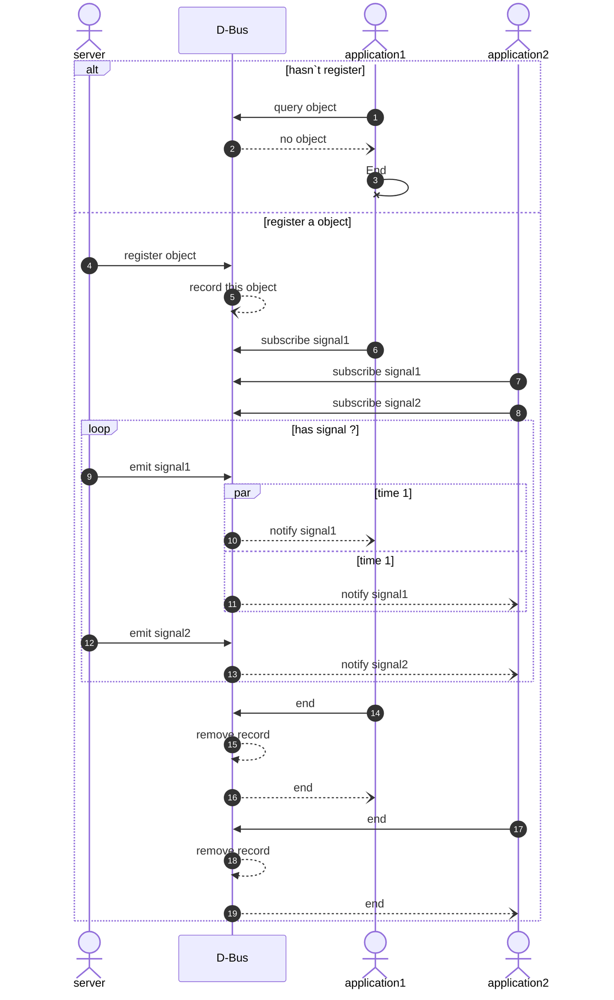
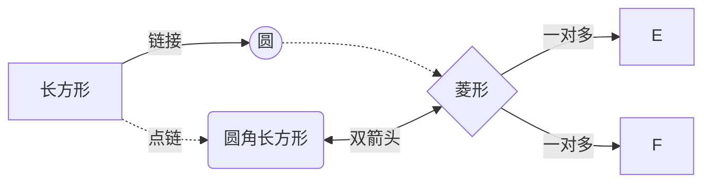

# MERMAID

## mermaid example

### 插入甘特图

```mermaid
gantt
       
        title Adding GANTT diagram functionality to mermaid
        section 现有任务
        已完成               :done,    des1, 2014-01-06,2014-01-08
        进行中               :active,  des2, 2014-01-09, 4d
        计划中               :         des3, after des2, 5d
```

### 插入UML图

example 1

```mermaid
sequenceDiagram
actor a as 张三
participant b as 李四
a ->> b: 你好！李四, 最近怎么样?
b -->> 王五: 你最近怎么样，王五？
b --x a: 我很好，谢谢!
b -x 王五: 我很好，谢谢!
Note right of b: 李四想了很长时间, 文字太长了<br/>不适合放在一行.
 
autonumber
b-->>王五: 打量着王五...
a->>王五: 很好... 王五, 你怎么样?
```

exmaple 2

```mermaid
sequenceDiagram
    actor s as server
    participant b as D-Bus 
    actor a as application1
    actor c as application2
    autonumber
    alt hasn`t register
        a->>b:query object
        b--)a: no object
        a -x a:  End
    else register a object
        s->>b: register object
        b--)b: record this object
        a->>b: subscribe signal1 
        c->>b: subscribe signal1
        c->>b: subscribe signal2
        loop has signal ?
            s->>b: emit signal1
            par time 1
                b--)a: notify signal1
            and time 1
                b--)c: notify signal1
            end
            s->>b: emit signal2
            b--)c: notify signal2
        end
        a->>b: end
        b-->>b: remove record
        b--)a: end
        c->>b: end
        b-->>b: remove record
        b--)c: end
    end

```

### 插入Mermaid流程图

```mermaid
graph LR
A[长方形] -- 链接 --> B((圆))
A -.点链.-> C(圆角长方形)
B -.-> D{菱形}
C <--双箭头--> D
D --一对多--> E & F
```
