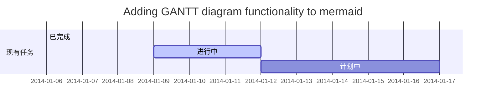
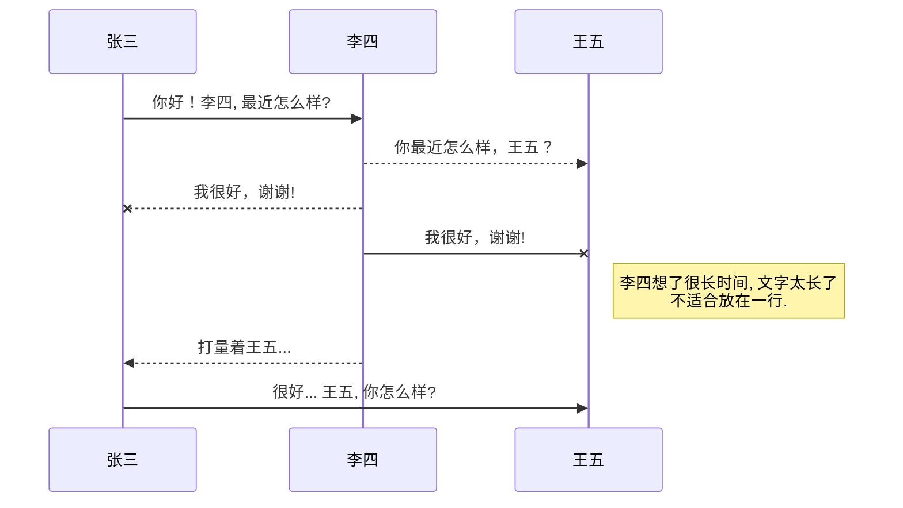
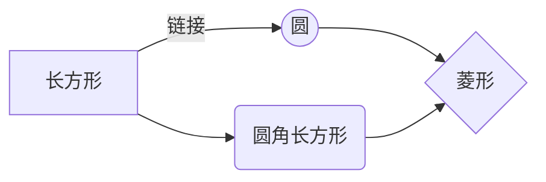
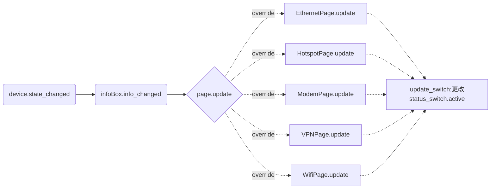
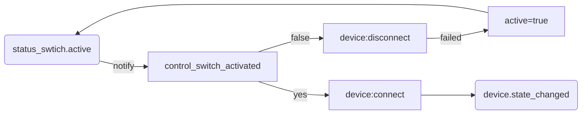
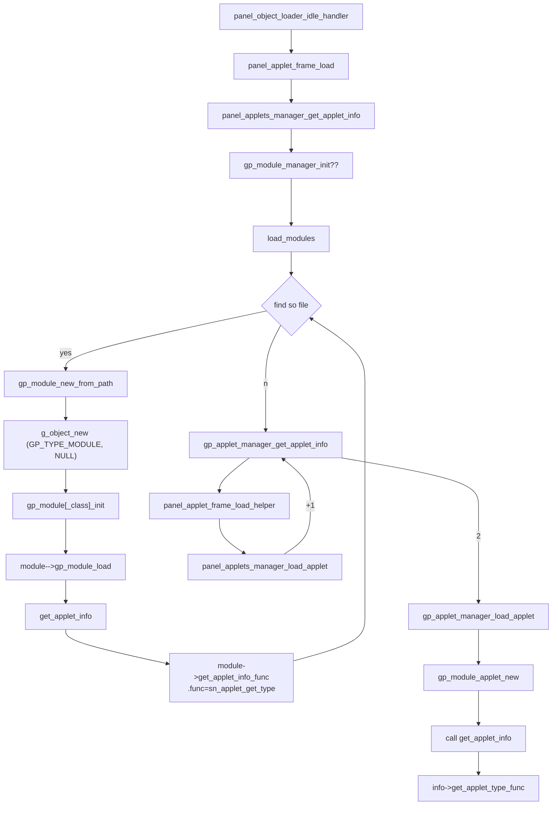

## mermaid example
插入甘特图
-----------------


插入UML图
------------


插入Mermaid流程图
--------



 

## asdfasd

1. 电源相关的设置：org.gnome.settings-daemon.plugins.power


2. 播放源码
```vala
Canberra.Context context;
Canberra.Context.create (out context);
context.play (0, Canberra.PROP_EVENT_ID, "desktop-login"
                ,Canberra.PROP_CANBERRA_CACHE_CONTROL, "never", null
                );
```
- desktop-login : 登录音
- desktop-logout  : 注销ID
- desktop-screen-lock ：锁屏ID

```

3. 系统提示音开关
``` xml
  <schema id="io.patapua.settings.sound" path="/io/patapua/settings/sound/">
    <key name="login-play" type="b">
      <default>false</default>
      <summary>play login/logout sound</summary>
      <description>whether to play sound when login or logout</description>
    </key>
  </schema>

```
4. 注销相关的设置（screensaver屏保）
- setting path:/org/gnome/desktop/screensaver/
   - logout_enable
   - logout_command


5. ` sudo apt install gnome-session-canberra `

6. `paplay /usr/share/sounds/ubuntu/stereo/desktop-login.ogg`


7. sh
```sh
#!/bin/sh
ret=`gsettings get org.gnome.desktop.sound event-sounds`
echo $ret
if [ $ret = "true"  ] ;then
	paplay /usr/share/sounds/freedesktop/stereo/bell.oga 
fi
```


8. systemed
```sh
[Unit]
Description=Cleanup of Temporary Directories
Documentation=man:tmpfiles.d(5) man:systemd-tmpfiles(8)
DefaultDependencies=no
Conflicts=shutdown.target
After=local-fs.target time-set.target
Before=shutdown.target

[Service]
Type=oneshot
ExecStart=systemd-tmpfiles --clean
SuccessExitStatus=DATAERR
IOSchedulingClass=idle

```

> conflicts with all system services：指那些定义了Conflicts=shutdown.target 和 Before=shutdown.target 依赖关系（除非明确设置了 DefaultDependencies=no ，否则 service 单元将会自动添加这些依赖）的服务，这些服务在shutdown.target运行之前会停止。
————————————————
原文链接：https://blog.csdn.net/z1026544682/article/details/104538239


usr: gsd-sound.target

## 更改插件名称
1. 改依赖包名
2. 改PLUG文件
   1. 改类型名
   2. 改code_name
3. 改安装路径
4. 摸索修改
`grep switchboard . -rn --exclude-dir={build,.git,.github} --exclude=*.{po,pot} `

5. 修改翻译文件
 - 修改主工程的meson.build中的gettext_name 
```
gettext_name = 'settingboard-plug-' + meson.project_name() 
```
 - rename  xml中的translation type
 - 寻找是否有`GLib.Intl.bindtextdomain`函数，找出定义的宏参数修改
  

##  screensaver
`xdg-screensaver`
`mplayer -fs -nosound -noautosub -loop 0 -fixed-vo`
``
[add xnoise-screensaver-manager.vala ](https://github.com/jozadaquebatista/xnoise/commit/84ec07c29d34d10c629acda813202afe7e34c7fe)

Actor设置图形
```vala
  Gdk.Pixbuf pixbuf = Gala.Utils.get_icon_for_window (window, icon_size, scale);
  try {
      var image = new Clutter.Image ();
      Cogl.PixelFormat pixel_format = (pixbuf.get_has_alpha () ? Cogl.PixelFormat.RGBA_8888 : Cogl.PixelFormat.RGB_888);
      image.set_data (pixbuf.get_pixels (), pixel_format, pixbuf.width, pixbuf.height, pixbuf.rowstride);
      Clutter.Actor actor = new Clutter.Actor()
      actor.set_content (image);
      actor.set_size(pixbuf.width, pixbuf.height);
  } catch (Error e) {
```
Actor动画
```vala
    opacity = 0 // 初始化opacity值

    //设置此状态后，后面的动态变化的属性值即使赋值也不会立即更改,会按设置的easing模式更改
    save_easing_state ();
    set_easing_mode (AnimationMode.EASE_OUT_QUAD);
    set_easing_duration (200);

    //设置在duration时间后要达到的动画属性, 只要是animatable的属性都可以设置
    opacity = 255;
    warning("opacity = %d",opacity);// opacity = 0  ,设置后当前值仍为0,在随后的200ms慢慢为255
    ...

    //恢复设置值立即生效模式
    //这句只是恢复easing_state,不是恢复opacity值到0的哦！！！！，因此下次还要初始化它为0
    restore_easing_state ();
    

```

### linux下使用feh一个基于命令行的高速图片查看器的方法
```sh
 feh -x -F -r -Y -Z -z -A slideshow -D 2 "$DIR" &
```

1. [simplescreensaver](https://github.com/jamcnaughton/useful-linux-scripts/tree/master/simplescreensaver) - shell


## 通知
1. 开启消息服务进程 io.elementary.notifications
2. 发送消息
- 使用命令行：`notify-send messge`
- 使用测试程序：io.elementary.notifications.demo

### 终端页面无法回滚，不能使用上和pageup键回看,原因是pager默认配置为more,改为less即可
```sh
ann@dell:settingboard-plug-applications-1.0.0$ sudo update-alternatives --config pager 
有 2 个候选项可用于替换 pager (提供 /usr/bin/pager)。

  选择       路径          优先级  状态
------------------------------------------------------------
  0            /usr/bin/less    77        自动模式
* 1            /bin/more        50        手动模式
  2            /usr/bin/less    77        手动模式

要维持当前值[*]请按<回车键>，或者键入选择的编号：0
update-alternatives: 使用 /usr/bin/less 来在自动模式中提供 /usr/bin/pager (pager)

```


## display
- data stream logic
framebuffer-->CRTCs（从framebuffer拿到数据送往encoder，）-->encoder（将数据流编码成对应数据线识别的数据流）-->connector(物理数据线，HDMI，VGA)
  - **serial**:是代表当前状态的唯一标识符 屏幕的。它必须传递回 ApplyConfiguration() 并且每次配置更改都会增加（以便 mutter 可以检测到新的配置是基于旧的 状态）
  - **CRTCs**:a logic monitor,组合成的坐标空间中的一部分, 分屏、整合转换坐标,clone模式一对多个monitors,它的数量决定了最大显示的屏数
  - **output**: a physical screen, connected to the computer
  - **modes**:a set of parameters that are applied to each output
  - 

- display dbus
```vala
[DBus (name = "org.gnome.Mutter.DisplayConfig")]
public interface MutterDisplayConfigInterface : Object {
    public abstract void get_resources (out uint serial, out MutterReadDisplayCrtc[] crtcs, out MutterReadDisplayOutput[] outputs, out MutterReadDisplayMode[] modes, out int max_screen_width, out int max_screen_height) throws Error;
    public abstract void apply_configuration (uint serial, bool persistent, MutterWriteDisplayCrtc[] crtcs, MutterWriteDisplayOutput[] outputs) throws Error;
    public abstract int change_backlight (uint serial, uint output, int value) throws Error;
    public abstract void get_crtc_gamma (uint serial, uint crtc, out uint[] red, out uint[] green, out uint[] blue) throws Error;
    public abstract void set_crtc_gamma (uint serial, uint crtc, uint[] red, uint[] green, uint[] blue) throws Error;
    public abstract int power_save_mode { get; set; }
    public signal void monitors_changed ();
    /***
      @serial: configuration serial
      @monitors: available monitors, represent connected physical monitors
      @logical_monitors: current logical monitor configuration,
      @properties: display configuration properties
    ***/
    public abstract void get_current_state (out uint serial, out MutterReadMonitor[] monitors, out MutterReadLogicalMonitor[] logical_monitors, out GLib.HashTable<string, GLib.Variant> properties) throws Error;
    /***
      @serial: configuration serial
      @method: configuration method
      @logical_monitors: monitors configuration, consists of a list of logical monitor configurations
      @properties: properties
    ***/
    public abstract void apply_monitors_config (uint serial, MutterApplyMethod method, MutterWriteLogicalMonitor[] logical_monitors, GLib.HashTable<string, GLib.Variant> properties) throws Error;
}

```
- struct demenstration
```vala
public struct MutterWriteLogicalMonitor {
    public int x;
    public int y;
    public double scale;
    public DisplayTransform transform;
    public bool primary;// true if this is the primary logical monitor
    public struct MutterWriteMonitor {
        public string connector;
        public string monitor_mode;//monitor mode ID
        public GLib.HashTable<string, GLib.Variant> properties;
    } [] monitors;
}

public struct MutterReadMonitor {
    public struct MutterReadMonitorInfo {
        public string connector;
        public string vendor;
        public string product;
        public string serial;
        public uint hash { get { return (connector + vendor + product + serial).hash (); } }
    } monitor;//
    public struct MutterReadMonitorMode {
        public string id;
        public int width;
        public int height;
        public double frequency;
        public double preferred_scale;
        public double[] supported_scales;
        public GLib.HashTable<string, GLib.Variant> properties;//is-current,is-preferred,is-interlaced
    }[] modes;//当下monitor的可用模式
    public GLib.HashTable<string, GLib.Variant> properties;//width-mm,height-mm,is-underscanning,max-screen-size,is-builtin,display-name
}

public struct MutterReadLogicalMonitor {
    public int x;
    public int y;
    public double scale;
    public DisplayTransform transform;
    public bool primary;// true if this is the primary logical monitor
    public struct MutterReadMonitorInfo {
        public string connector;
        public string vendor;
        public string product;
        public string serial;
        public uint hash { get { return (connector + vendor + product + serial).hash (); } }
    }[] monitors;// monitors displaying this logical monitor
    public GLib.HashTable<string, GLib.Variant> properties; // layout-mode(1:logical,2:physical)
}
```

- (MutterWriteLogicalMonitor)logical_monitor <---> (Display.VirtualMonitor)virtual_monitor
- (MutterWriteMonitor)mutter_monitor         <---> (Display.Monitor)virtual_monitor.monitors
- MutterReadMonitor[] mutter_monitors     <---> (Display.Monitor linkedlist)monitors + displayname,is_builtin,modes{is_preferred,is_current}
- MutterReadLogicalMonitor[] mutter_logical_monitors <---> (Display.VirtualMonitor linkedlist)virtual_monitors

```
    public int monitor_number { get { return monitors.size; } }
    public int virtual_monitor_number { get { return virtual_monitors.size; } }
    public bool is_mirrored { get { return virtual_monitors.size == 1 && monitors.size > 1; } }
```
- xranr: 调节显示的命令行程序

```xranr --output xxx --brightness 0.8```

```c
dpy = XOpenDisplay(display_name);
screen = DefaultScreen(dpy);
root = RootWindow(dpy, screen);

get_screen(True);
  	XRRGetScreenSizeRange(dpy, root, &minWidth, &minHeight, &maxWidth, &maxHeight);
    res = XRRGetScreenResourcesCurrent(dpy, root);
get_crtcs();
  for (c = 0; c < res->ncrtc; c++)
    XRRGetCrtcInfo(dpy, res, res->crtcs[c])
    XRRGetPanning(dpy, res, res->crtcs[c]);
    XRRGetCrtcTransform(dpy, res->crtcs[c], &attr)

get_outputs();
  XRRGetOutputInfo(dpy, res, res->outputs[o]);
  output = find_output(&output_name); 
  output?:output = add_output();


set_positions();
set_screen_size();

pick_crtcs();
set_crtcs();
mark_changing_crtcs();

fb_width_mm = DisplayWidthMM(dpy, screen);
fb_height_mm = DisplayHeightMM(dpy, screen);

set_panning();//skip
set_gamma();
  size = XRRGetCrtcGammaSize(dpy, crtc->crtc.xid);
  crtc_gamma = XRRAllocGamma(size);
  for (i = 0; i < size; i++)
    	if (gammaRed == 1.0 && output->brightness == 1.0)//include gammaGreen,gammaBlue
				crtc_gamma->red[i] = (double)i / (double)(size - 1) * 65535.0;
			else
				crtc_gamma->red[i] = dmin(pow((double)i / (double)(size - 1), gammaRed) * output->brightness, 1.0) * 65535.0;
  XRRSetCrtcGamma(dpy, crtc->crtc.xid, crtc_gamma);

apply();
  XGrabServer(dpy);
  screen_apply();
  	XRRSetScreenSize(dpy, root, fb_width, fb_height, fb_width_mm, fb_height_mm);
  for (c = 0; c < res->ncrtc; c++)
		s = crtc_apply(crtc);//XRRSetCrtcConfig 亮度设置下去了
  set_primary();
  XUngrabServer(dpy);

```
亮度调节要点：
- 获取output的gamma和亮度值在函数`set_gamma_info()`中
```c
static void
set_gamma_info(output_t *output)
{
	XRRCrtcGamma *crtc_gamma;
	double i1, v1, i2, v2;
	int size, middle, last_best, last_red, last_green, last_blue;
	CARD16 *best_array;

	if (!output->crtc_info)
		return;

	size = XRRGetCrtcGammaSize(dpy, output->crtc_info->crtc.xid);
	if (!size)
	{
		warning("Failed to get size of gamma for output %s\n", output->output.string);
		return;
	}

	crtc_gamma = XRRGetCrtcGamma(dpy, output->crtc_info->crtc.xid);
	if (!crtc_gamma)
	{
		warning("Failed to get gamma for output %s\n", output->output.string);
		return;
	}

	/*
     * Here is a bit tricky because gamma is a whole curve for each
     * color.  So, typically, we need to represent 3 * 256 values as 3 + 1
     * values.  Therefore, we approximate the gamma curve (v) by supposing
     * it always follows the way we set it: a power function (i^g)
     * multiplied by a brightness (b).
     * v = i^g * b
     * so g = (ln(v) - ln(b))/ln(i)
     * and b can be found using two points (v1,i1) and (v2, i2):
     * b = e^((ln(v2)*ln(i1) - ln(v1)*ln(i2))/ln(i1/i2))
     * For the best resolution, we select i2 at the highest place not
     * clamped and i1 at i2/2. Note that if i2 = 1 (as in most normal
     * cases), then b = v2.
     */
	last_red = find_last_non_clamped(crtc_gamma->red, size);
	last_green = find_last_non_clamped(crtc_gamma->green, size);
	last_blue = find_last_non_clamped(crtc_gamma->blue, size);
	best_array = crtc_gamma->red;
	last_best = last_red;
	if (last_green > last_best)
	{
		last_best = last_green;
		best_array = crtc_gamma->green;
	}
	if (last_blue > last_best)
	{
		last_best = last_blue;
		best_array = crtc_gamma->blue;
	}
	if (last_best == 0)
		last_best = 1;

	middle = last_best / 2;
	i1 = (double)(middle + 1) / size;
	v1 = (double)(best_array[middle]) / 65535;
	i2 = (double)(last_best + 1) / size;
	v2 = (double)(best_array[last_best]) / 65535;
	if (v2 < 0.0001)
	{ /* The screen is black */
		output->brightness = 0;
		output->gamma.red = 1;
		output->gamma.green = 1;
		output->gamma.blue = 1;
	}
	else
	{
		if ((last_best + 1) == size)
			output->brightness = v2;
		else
			output->brightness = exp((log(v2) * log(i1) - log(v1) * log(i2)) / log(i1 / i2));
		output->gamma.red = log((double)(crtc_gamma->red[last_red / 2]) / output->brightness / 65535) / log((double)((last_red / 2) + 1) / size);
		output->gamma.green = log((double)(crtc_gamma->green[last_green / 2]) / output->brightness / 65535) / log((double)((last_green / 2) + 1) / size);
		output->gamma.blue = log((double)(crtc_gamma->blue[last_blue / 2]) / output->brightness / 65535) / log((double)((last_blue / 2) + 1) / size);
	}

	XRRFreeGamma(crtc_gamma);
}

```
- 设置亮度值在函数`set_gamma`中
  ```c
  	if (output->gamma.red == 0.0)
			output->gamma.red = 1.0;
		if (output->gamma.green == 0.0)
			output->gamma.green = 1.0;
		if (output->gamma.blue == 0.0)
			output->gamma.blue = 1.0;

		gammaRed = 1.0 / output->gamma.red;
		gammaGreen = 1.0 / output->gamma.green;
		gammaBlue = 1.0 / output->gamma.blue;

		for (i = 0; i < size; i++)
		{
			if (gammaRed == 1.0 && output->brightness == 1.0)
				crtc_gamma->red[i] = (double)i / (double)(size - 1) * 65535.0;
			else
				crtc_gamma->red[i] = dmin(pow((double)i / (double)(size - 1), gammaRed) * output->brightness, 1.0) * 65535.0;

			if (gammaGreen == 1.0 && output->brightness == 1.0)
				crtc_gamma->green[i] = (double)i / (double)(size - 1) * 65535.0;
			else
				crtc_gamma->green[i] = dmin(pow((double)i / (double)(size - 1), gammaGreen) * output->brightness, 1.0) * 65535.0;

			if (gammaBlue == 1.0 && output->brightness == 1.0)
				crtc_gamma->blue[i] = (double)i / (double)(size - 1) * 65535.0;
			else
				crtc_gamma->blue[i] = dmin(pow((double)i / (double)(size - 1), gammaBlue) * output->brightness, 1.0) * 65535.0;
		}

  ```


## unable to login  in 
```sh
apt install gnome-session
apt remove gnome-session
```
--------------------
## settingboard -- network
设备状态变更信号传导图
-------



**status_switch**开关设置的信号传导图
------------



------------------
## find git repository
```sh
for file in `ls` ; do cd $file; if [ -d .git ] ;then  git remote -v | grep fetch | grep leixa | awk {'print $2'}; fi; cd ->/dev/null ;done

#install build dependency
for i in `ls ./settingboard* --directory`;do  cd $i; sudo apt build-dep .;cd ->/dev/null;done


```
## gtk theme

###  flatpak app无法使用系统的theme
1. [Applying GTK themes to Flatpak applications](https://itsfoss.com/flatpak-app-apply-theme/)
   - Step 1: Give Flatpak apps access to GTK themes location
     - all app:`sudo flatpak override --filesystem=$HOME/.themes`
     - single app:`sudo flatpak override org.gnome.Calculator --filesystem=$HOME/.themes`
   - Step 2:Tell Flatpak apps which theme to use
     - all app:`sudo flatpak override --env=GTK_THEME=my-theme `
     - single app:`sudo flatpak override org.gnome.Calculator --env=GTK_THEME=my-theme `
   - Step 3: Test the theme change by running a Flatpak app
   - Revert the changes
     - all :`sudo flatpak override --reset`
     - single :`sudo flatpak override --reset org.example.app`
2. [How To Get Flatpak Apps To Use The Correct Gtk Theme](https://www.linuxuprising.com/2018/05/how-to-get-flatpak-apps-to-use-correct.html)
   下载对就的flatpak版本的主题
3. [How do I disable client side decoration globally in GNOME?](https://askubuntu.com/questions/961161/how-do-i-disable-client-side-decoration-globally-in-gnome)

  > I was able to run the evince PDF viewer with decorations provided by my window manager (Openbox) on Ubuntu 18.04 as follows:

  > `$ sudo apt-get install gtk3-nocsd`

  > `$ gtk3-nocsd evince`


4. GTK_CSD=1, 在启动程序将禁止窗口管理器自动加标题栏


5. chrome设置默认的系统标题栏
  - 路径：

  ```mermaid
  graph LR
  A("～/.config/goolge-chrome/Default/Preferences")
  B(custom_chrome_frame)
  A-->B
  ```
6. 针对默认加载的的标题栏的css的样式，试验发现只在登录环境时加载一次（可能libgtk3库首次加载时会读取记录一次默认的样式到自己的上下文中），如果改变了样式文件需要测试默认标题栏是否更改，则必须注销重新登录才能测试出来，否则更改无效。
标题栏的button在目前的gtk.css中如下（大致在1306行）：
window.ssd .titlebar button {
  border-radius: 3px;
}
   


### gtk default title bar source 
1. file: gtk/gtkwindow.c
```c
static void
gtk_window_realize (GtkWidget *widget)
{
  GtkWindow *window = GTK_WINDOW (widget);
  GtkWindowPrivate *priv = gtk_window_get_instance_private (window);
  GdkSurface *surface;
  GdkFrameClock *frame_clock;

  /* Create default title bar */
  if (!priv->client_decorated && gtk_window_should_use_csd (window))
    {
      priv->use_client_shadow = gtk_window_supports_client_shadow (window);
      if (priv->use_client_shadow)
        {
          gtk_window_enable_csd (window);

            if (priv->title_box == NULL)
              {
                priv->title_box = gtk_header_bar_new ();
                gtk_widget_add_css_class (priv->title_box, "titlebar");
                gtk_widget_add_css_class (priv->title_box, "default-decoration");

                gtk_widget_insert_before (priv->title_box, widget, NULL);
              }

            update_window_actions (window);
        }
    }

  ...

  GTK_WIDGET_CLASS (gtk_window_parent_class)->realize (widget);

  ...

  if (priv->title)
    gdk_toplevel_set_title (GDK_TOPLEVEL (surface), priv->title);

  gdk_toplevel_set_decorated (GDK_TOPLEVEL (surface), priv->decorated && !priv->client_decorated);

  ...
}

void
gtk_window_set_titlebar (GtkWindow *window,
                         GtkWidget *titlebar)
{
  ...

  unset_titlebar (window);

  if (titlebar == NULL)
    {
      /* these are updated in realize() */
      priv->client_decorated = FALSE;
      gtk_widget_remove_css_class (widget, "csd");
      gtk_widget_remove_css_class (widget, "solid-csd");
    }
  else
    {
      priv->use_client_shadow = gtk_window_supports_client_shadow (window);

      gtk_window_enable_csd (window);
      priv->titlebar = titlebar;
      priv->title_box = titlebar;
      gtk_widget_insert_before (priv->title_box, widget, NULL);

      gtk_widget_add_css_class (titlebar, "titlebar");
    }
  ...
}

static void
gtk_window_enable_csd (GtkWindow *window)
{
  GtkWindowPrivate *priv = gtk_window_get_instance_private (window);
  GtkWidget *widget = GTK_WIDGET (window);

  /* We need a visual with alpha for client shadows */
  if (priv->use_client_shadow)
    gtk_widget_add_css_class (widget, "csd");
  else
    gtk_widget_add_css_class (widget, "solid-csd");

  priv->client_decorated = TRUE;
}

static gboolean
gtk_window_should_use_csd (GtkWindow *window)
{
  GtkWindowPrivate *priv = gtk_window_get_instance_private (window);
  const char *csd_env;

  if (priv->csd_requested)
    return TRUE;

  if (!priv->decorated)
    return FALSE;

  csd_env = g_getenv ("GTK_CSD");

  ...

  return (g_strcmp0 (csd_env, "1") == 0);
}
```

- 代码中的gdk_toplevel_set_decorated (GDK_TOPLEVEL (surface), priv->decorated && !priv->client_decorated);
> /*
> * Setting @decorated to %FALSE hints the desktop environment
> * that the surface has its own, client-side decorations and
> * does not need to have window decorations added.
> */
在自己代码中可以直接调用`gtk_window_set_decorated`设置


```Mermaid
flowchart LR
F0[gtk_window_init]
F1(gtk_window_set_titlebar)
F2(gtk_window_realize)
F3(gtk_widget_show)

C1{tiltebar!=null ?}
C2{"client_decorated==false<br> && decorated==true<br> && (GTK_CSD=1 or csd_requested=true)"}

AACSD((add csd/solid-csd,titlebar<br>client_decorated=true))
ARCSD((remove csd/solid-csd<br>client_decorated=false))
AADEF((add default csd))

SINIT[[decorated:true<br>client_decorated:false<br>GTK_CSD=0]]
SCSD1[[csd/solid-csd<br>titlebar]]
SNCSD[[default: ssd]]
SCSD2[[csd/solid-csd<br>titlebar<br>default-decoration]]


F0---SINIT--> F1
F0---SINIT--> |1|F3
F1-.-C1-.->|yes| AACSD --> |2| F3
C1-.->|no| ARCSD --> |3| F3


F3-->F2-.-C2-.no 2.-> SCSD1 
C2-.no 1,3-.-> SNCSD
C2-.yes 1,3-.-> AADEF--> SCSD2

```

## gnome-panel
### source code review

### gnome-panel notification
必须项:
- indicator-
/usr/lib/x86_64-linux-gnu/indicator-application/indicator-application-service--->creat watcher
- application---> StatusNotifierItem
- gnome-panel---> display notification area


## AWS  cml
### install
```sh
curl "https://awscli.amazonaws.com/awscli-exe-linux-x86_64.zip" -o "awscliv2.zip"
unzip awscliv2.zip
sudo ./aws/install
aws configure //
```

### configure快速配置
`aws configure`
### s3 cli 文档
- https://docs.aws.amazon.com/cli/latest/reference/s3/


## http
### question
1. 怎么获取后台仓库的所有可用包信息？
2. 获取的包库的存储格式？

